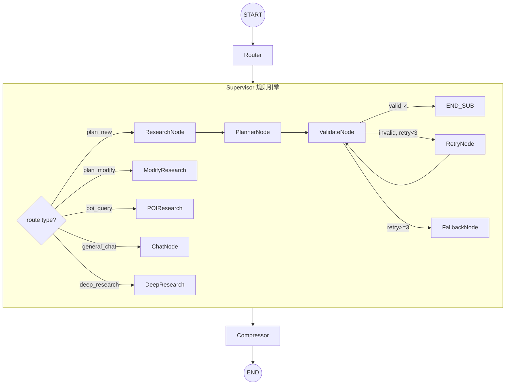
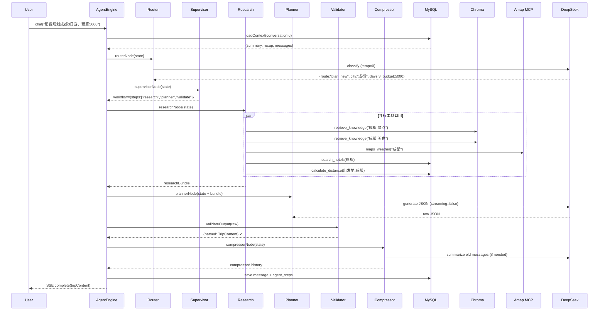

# Trip 多 Agent 架构设计方案

## Context

Trip 项目当前采用 LangGraph 双图架构（`chatGraph` + `plannerGraph`），通过关键词路由分发到专家节点。随着业务复杂度增长，暴露出以下痛点：路由准确率受限（纯关键词匹配）、工具串行执行延迟高、单一 Agent 承载所有职责、上下文缺乏按 Agent 维度的精细管控、可观测性停留在平铺 Step 层级。

本方案基于现有代码结构和技术栈（LangChain/LangGraph、Chroma RAG、DeepSeek LLM、高德 MCP），设计一套 **5 层分离、6 Agent 协作**的多 Agent 架构，支持渐进式迁移，不破坏现有 API 契约。

---

## 一、架构总览

### 1.1 五层架构

```
┌─────────────────────────────────────────────────────────────────┐
│                Layer 0 · 入口层 (AgentEngine)                    │
│              统一 chat() / recommend() 入口，不变签名              │
├─────────────────────────────────────────────────────────────────┤
│                Layer 1 · 编排层 (Orchestrator Graph)             │
│  ┌──────────┐    ┌────────────┐    ┌───────────┐               │
│  │  Router   │───▶│ Supervisor │───▶│ Compressor│──▶ END       │
│  │ (LLM分类) │    │ (规则引擎)  │    │ (上下文)   │               │
│  └──────────┘    └─────┬──────┘    └───────────┘               │
│                        │                                        │
├────────────────────────┼────────────────────────────────────────┤
│                Layer 2 · Agent 层 (Subgraphs)                   │
│         ┌──────────────┼──────────────┐                         │
│         ▼              ▼              ▼                         │
│  ┌────────────┐ ┌───────────┐ ┌────────────┐                   │
│  │ Research   │ │ Planner   │ │ Conversa-  │                   │
│  │ Agent      │ │ Agent     │ │ tionalist  │                   │
│  │ (数据收集)  │ │ (行程生成) │ │ (通用对话)  │                   │
│  └────────────┘ └───────────┘ └────────────┘                   │
│                                                                 │
├─────────────────────────────────────────────────────────────────┤
│                Layer 3 · 共享服务层                               │
│  ┌────────┐ ┌──────────┐ ┌──────────┐ ┌──────────┐ ┌────────┐ │
│  │ToolCache│ │Resilience│ │MemoryMgr│ │SpanTrack │ │LLMFact │ │
│  └────────┘ └──────────┘ └──────────┘ └──────────┘ └────────┘ │
├─────────────────────────────────────────────────────────────────┤
│                Layer 4 · 外部集成层                               │
│  ┌──────┐  ┌────────┐  ┌─────────┐  ┌────────┐  ┌──────────┐  │
│  │Chroma│  │DeepSeek│  │Amap MCP │  │ MySQL  │  │  Redis   │  │
│  │ RAG  │  │  LLM   │  │ Tools   │  │ Prisma │  │          │  │
│  └──────┘  └────────┘  └─────────┘  └────────┘  └──────────┘  │
└─────────────────────────────────────────────────────────────────┘
```

### 1.2 核心设计原则

- **专职化**：每个 Agent 职责单一，拥有独立 prompt、工具集、LLM 配置
- **可组合**：通过 LangGraph Subgraph 独立运行或组合编排
- **渐进迁移**：基于现有 `chatGraph`/`plannerGraph` 增量演进，环境变量切换
- **可观测**：树状 Span 追踪，Token 消耗精确到 Agent 粒度

---

## 二、Agent 角色与职责划分

### 2.1 Agent 总览

| Agent | 职责 | LLM 配置 | 工具权限 | 输出类型 |
|---|---|---|---|---|
| **Router** | 意图分类 + 结构化参数提取 | 轻量模型（temperature=0） | 无 | `IntentResult` |
| **Supervisor** | 工作流编排决策 | 无（规则引擎） | 无 | `WorkflowPlan` |
| **Research** | RAG 检索 + 工具数据收集 | 无（纯工具调用） | 全部工具 | `ResearchBundle` |
| **Planner** | 结构化行程 JSON 生成 | 主力模型（temp=0.7） | 无 | `TripContent` |
| **Conversationalist** | 通用对话 + 旅行问答 | 主力模型（streaming） | RAG + 天气 | Markdown |
| **Compressor** | 上下文摘要与压缩 | 轻量模型 | 无 | 压缩历史 |

### 2.2 Router Agent

**替代现有** `nodes/router.ts` 的关键词匹配，升级为 LLM 分类 + 结构化提取。

```typescript
type RouteType = 'plan_new' | 'plan_modify' | 'poi_query' | 'general_chat' | 'deep_research'

interface IntentResult {
  route: RouteType
  city: string | null
  days: number | null
  budget: number | null
  departureCity: string | null
  confidence: number          // 0-1，低于 0.6 回退到 general_chat
  modifyTarget: {             // 仅 plan_modify 有值
    day: number | null
    field: 'spot' | 'food' | 'accommodation' | null
    action: 'add' | 'replace' | 'remove' | null
  } | null
  rawReasoning: string        // 判断理由（Trace 用）
}
```

**快速路径优化**：保留 `isPlanningRequest()` 关键词匹配作为快速路径——高置信关键词直接路由，仅低置信消息走 LLM 分类，避免额外 500-800ms 延迟。

### 2.3 Research Agent

**增强现有** `nodes/research.ts`，核心升级：

- **动态任务生成**：根据 Intent 动态组装查询任务（而非硬编码 5 个工具调用）
- **并发信号量控制**：`maxConcurrency=5`，防止触发高德 API 限流
- **增量研究**：多轮对话时只查增量信息

```typescript
interface ResearchTask {
  key: string                    // bundle 中的 key
  tool: string                   // 工具名称
  args: Record<string, unknown>  // 工具参数
  priority: 'required' | 'optional'
  timeout: number                // 独立超时（ms）
  fallback: string               // 降级文案
}
```

### 2.4 Planner Agent

**增强现有** `nodes/planner.ts`，核心升级：

- **三级重试策略**：
  - Level 1: JSON 解析失败 → JSON Repair（不消耗 Token）
  - Level 2: Zod Schema 校验失败 → LLM 重试（携带错误信息）
  - Level 3: 业务逻辑校验（预算分配、地理距离合理性）→ LLM 重试
- **多步生成**：5 天以上行程拆分为"骨架生成 → 逐日填充"

### 2.5 Conversationalist Agent

**重构自** `chatPlanner.ts` + `legacyAgentNode`，精简工具集（仅 RAG + 天气），使用轻量 system prompt。

---

## 三、编排与协作机制

### 3.1 全局状态定义

基于现有 `PlannerState`（`state.ts`）扩展，向后兼容：

```typescript
export const OrchestratorState = Annotation.Root({
  // ── 继承自 PlannerState ──
  userId: Annotation<number>,
  conversationId: Annotation<number>,
  message: Annotation<string>,
  conversationHistory: Annotation<BaseMessage[]>,
  userPreferences: Annotation<Record<string, any> | null | undefined>,
  city: Annotation<string>,
  budget: Annotation<number | undefined>,
  days: Annotation<number | undefined>,
  departureCity: Annotation<string | undefined>,
  researchBundle: Annotation<ResearchBundle>,
  rawOutput: Annotation<string | undefined>,
  parsed: Annotation<TripContent | undefined>,
  usage: Annotation<TokenUsage>,
  errors: Annotation<string[]>,

  // ── 新增字段 ──
  intent: Annotation<IntentResult | undefined>,
  workflow: Annotation<WorkflowPlan | undefined>,
  currentStep: Annotation<string | undefined>,
  executionLog: Annotation<WorkflowStep[]>,
  spans: Annotation<AgentSpan[]>,
  retryCount: Annotation<number>,
  maxRetries: Annotation<number>,
})

interface WorkflowPlan {
  steps: string[]           // Agent 执行序列
  parallel: boolean
}

interface WorkflowStep {
  agentId: string
  status: 'pending' | 'running' | 'completed' | 'failed'
  startedAt?: number
  completedAt?: number
  error?: string
}
```

### 3.2 主编排图



### 3.3 Supervisor 路由逻辑（规则引擎，非 LLM）

```typescript
const workflowPlans: Record<RouteType, WorkflowPlan> = {
  plan_new:     { steps: ['research', 'planner', 'validate'], parallel: false },
  plan_modify:  { steps: ['research', 'modifier', 'validate'], parallel: false },
  poi_query:    { steps: ['research'], parallel: false },
  general_chat: { steps: ['conversationalist'], parallel: false },
  deep_research:{ steps: ['research', 'research', 'conversationalist'], parallel: true },
}
```

### 3.4 Subgraph 设计

```typescript
// Research Subgraph: plan_tasks → execute_tools(并发) → merge_results
function buildResearchSubgraph() {
  return new StateGraph(ResearchState)
    .addNode('plan_tasks', planResearchTasksNode)
    .addNode('execute_tools', executeToolsNode)
    .addNode('merge_results', mergeResultsNode)
    .addEdge('__start__', 'plan_tasks')
    .addEdge('plan_tasks', 'execute_tools')
    .addEdge('execute_tools', 'merge_results')
    .addEdge('merge_results', END)
    .compile()
}

// Planner Subgraph: generate → repair_json → validate_schema → validate_business
function buildPlannerSubgraph() {
  return new StateGraph(PlannerSubState)
    .addNode('generate', generateNode)
    .addNode('repair_json', repairJsonNode)       // Level 1: 不消耗 Token
    .addNode('validate_schema', validateSchemaNode)
    .addNode('validate_business', validateBusinessNode)
    .addNode('retry', retryNode)
    .addEdge('__start__', 'generate')
    .addEdge('generate', 'repair_json')
    .addEdge('repair_json', 'validate_schema')
    .addConditionalEdges('validate_schema', s => s.schemaValid ? 'validate_business' : 'retry')
    .addConditionalEdges('validate_business', s => s.businessValid ? END : 'retry')
    .addConditionalEdges('retry', s => s.retryCount < 3 ? 'repair_json' : END)
    .compile()
}
```

### 3.5 Agent 间通信

通过**共享状态**通信（LangGraph 原生机制）：

| 通信路径 | 传递机制 | 数据 |
|---|---|---|
| Router → Supervisor | `state.intent` | 意图分类结果 |
| Supervisor → Research | `state.city/days/budget` | 规划参数 |
| Research → Planner | `state.researchBundle` → ToolMessage 注入 | 工具数据 |
| Planner → Validate | `state.rawOutput` | 原始 JSON |
| Validate → Planner(重试) | `state.errors` | 校验错误 |
| 所有 Agent → Compressor | `state.usage` | 累计 Token |

---

## 四、上下文与记忆共享

### 4.1 Token 预算分配

每个 Agent 独立 Token 预算，避免全局上下文爆炸：

```typescript
interface ContextBudget {
  systemPromptTokens: number
  maxHistoryTokens: number
  researchTokens: number
  outputTokens: number
}

// 按 route 类型差异化分配
const budgets: Record<RouteType, ContextBudget> = {
  plan_new:      { systemPromptTokens: 3000, maxHistoryTokens: 4000, researchTokens: 8000, outputTokens: 16000 },
  plan_modify:   { systemPromptTokens: 3000, maxHistoryTokens: 6000, researchTokens: 4000, outputTokens: 12000 },
  general_chat:  { systemPromptTokens: 2000, maxHistoryTokens: 8000, researchTokens: 4000, outputTokens: 4000 },
  deep_research: { systemPromptTokens: 2000, maxHistoryTokens: 6000, researchTokens: 12000, outputTokens: 8000 },
  poi_query:     { systemPromptTokens: 2000, maxHistoryTokens: 8000, researchTokens: 4000, outputTokens: 4000 },
}
```

### 4.2 短期对话记忆（三层架构，兼容现有系统）

```
消息流入 → estimateTokens() → 累计 > HISTORY_MAX_TOKENS(16000)?
                                  │
                    ┌─────────────┼─────────────┐
                    ▼             ▼             ▼
              早期消息       中期消息       近期消息
              → summary     → recap       → 原文保留
              (关键决策)    (对话脉络)    (滑动窗口)
                    │             │             │
                    └─────────────┼─────────────┘
                                  ▼
                    组合为压缩上下文 → 注入 Agent system prompt
```

- 现有 `loadContext()` 返回 `{ systemSummary, conversationRecap, recentMessages }` — **保持不变**
- 新增：每个 Agent 收到独立的 Token 预算，由 `ContextBudgetAllocator` 控制裁剪

### 4.3 长期用户偏好记忆

扩展现有 `User.preferences` JSON 字段（无需 Schema 变更）：

```typescript
interface UserLongTermMemory {
  preferences: {                    // 静态偏好（现有）
    travelStyle: string | null
    budgetLevel: string | null
    pace: string | null
    avoidCrowds: boolean | null
    interests: string[] | null
  }
  learnedPreferences: {             // 学习偏好（新增，从对话中提取）
    preferredCities: string[]
    avoidedCategories: string[]
    typicalBudget: number | null
    typicalDays: number | null
    lastUpdated: string
  }
  tripPatterns: {                   // 行程模式（新增，从 Trip + Feedback 聚合）
    totalTrips: number
    avgSatisfaction: number | null
    commonDestinations: string[]
    preferredSeasons: string[]
  }
}
```

**更新时机**：每次对话结束后，Compressor 节点异步提取偏好信号并更新 `learnedPreferences`。

### 4.4 避免上下文爆炸的五道防线

| 策略 | 实现 | 触发条件 |
|---|---|---|
| Token 预算裁剪 | 每个 Agent 独立预算 + 滑动窗口 | 每次 Agent 调用前 |
| Research 摘要 | researchBundle > 4000 token 时 LLM 压缩 | merge_results 节点 |
| 历史压缩 | 现有 Compressor（COMPACT_TARGET=12000） | 累计 > HISTORY_MAX_TOKENS |
| 工具结果去重 | ToolCache embedding 匹配（bge-small-zh-v1.5） | 每次工具调用前 |
| 前轮输出截断 | plan_modify 场景只保留相关日期 | modify 路由时 |

---

## 五、工具调用与外部集成

### 5.1 工具权限矩阵

```typescript
const TOOL_REGISTRY: Record<string, ToolPermission[]> = {
  research: [
    { tool: 'retrieve_knowledge', maxCalls: 5, timeout: 8000, cacheable: true },
    { tool: 'search_hotels',      maxCalls: 3, timeout: 5000, cacheable: true },
    { tool: 'calculate_distance',  maxCalls: 5, timeout: 3000, cacheable: true },
    { tool: 'maps_weather',       maxCalls: 2, timeout: 5000, cacheable: true },
    { tool: 'maps_search_poi',    maxCalls: 5, timeout: 8000, cacheable: true },
    { tool: 'maps_direction',     maxCalls: 3, timeout: 5000, cacheable: true },
  ],
  conversationalist: [
    { tool: 'retrieve_knowledge', maxCalls: 2, timeout: 8000, cacheable: true },
    { tool: 'maps_weather',       maxCalls: 1, timeout: 5000, cacheable: true },
  ],
  planner: [],      // 不直接调用工具，消费 researchBundle
  router: [],       // 不调用工具
}
```

### 5.2 并发工具执行

基于现有 `Promise.allSettled` 升级，引入双层信号量：

```typescript
class ConcurrentToolExecutor {
  private globalSemaphore: Semaphore       // 全局 maxConcurrency=5
  private toolSemaphores: Map<string, Semaphore>  // 单工具并发限制

  async executeAll(tasks: ResearchTask[]): Promise<ToolResult[]> {
    const sorted = tasks.sort((a, b) =>
      a.priority === 'required' && b.priority !== 'required' ? -1 : 1
    )
    return Promise.allSettled(
      sorted.map(async (task) => {
        await this.globalSemaphore.acquire()
        const toolSem = this.toolSemaphores.get(task.tool)
        if (toolSem) await toolSem.acquire()
        try { return await this.executeSingle(task) }
        finally {
          if (toolSem) toolSem.release()
          this.globalSemaphore.release()
        }
      })
    )
  }
}
```

**与现有代码完全兼容**：包装顺序保持 `withToolCache → withResilience → 原始工具`。

### 5.3 失败重试与降级

```typescript
const RETRY_POLICIES: Record<string, RetryPolicy> = {
  retrieve_knowledge: { maxRetries: 2, backoffMs: [500, 1500], fallback: 'static_message' },
  maps_weather:       { maxRetries: 1, backoffMs: [1000], fallback: 'static_message' },
  maps_search_poi:    { maxRetries: 2, backoffMs: [500, 1000], fallback: 'alternative_tool' },
  // 降级链: maps_search_poi → retrieve_knowledge(Chroma RAG) → 静态文案
  // LLM 降级链: DeepSeek primary → Kimi fallback → 静态文案（现有逻辑）
}
```

---

## 六、可观测性与评估体系

### 6.1 树状 Span 追踪

升级现有 `TraceRecorder` 为分层 Span 模型，通过 `toFlatSteps()` 兼容现有 `AgentStep` 表：

```typescript
interface AgentSpan {
  spanId: string
  parentSpanId: string | null
  traceId: string
  messageId: number
  agentId: string                 // 'router' | 'research' | 'planner' | ...
  startedAt: number
  endedAt?: number
  durationMs?: number
  tokenUsage: TokenUsage          // per-Agent 粒度
  toolCalls: { tool: string; count: number; cacheHits: number; failures: number }[]
  error?: string
  children: AgentSpan[]
}
```

- `SpanTracker.toFlatSteps()` 扁平化为现有 `StepInput[]` 格式
- `args.spanId` + `args.parentSpanId` 携带层级信息
- 现有 `TraceRecorder.flush()` → `prisma.agentStep.createMany()` **无需改动**

### 6.2 Token 消耗监控

```typescript
interface TokenMetrics {
  perAgent: Record<string, {
    promptTokens: number; completionTokens: number
    cachedTokens: number; callCount: number
  }>
  perRequest: { routeType: RouteType; totalTokens: number; latencyMs: number }
}
```

- 内存环形缓冲区（最近 1000 条）
- 超阈值告警（单次 > 50000 token 或 cacheHitRate < 0.3）
- 聚合查询接口供管理后台使用

### 6.3 性能基准目标

| 指标 | 目标值 |
|---|---|
| Router 分类延迟 | < 800ms |
| Research 并行工具调用 | < 5s (P95) |
| Planner 行程生成 | < 15s (P95) |
| 端到端首字节 | < 20s (P95) |
| 单次规划 Token 消耗 | < 30000 |
| JSON 首次解析成功率 | > 85% |

### 6.4 评估框架扩展

| 评估维度 | 评估方式 | 目标 |
|---|---|---|
| 路由准确率 | Fixture + 精确匹配 | > 90% |
| 研究完整性 | bundle 覆盖率（4 维度） | > 80% |
| 行程质量 | Zod + 业务校验 + LLM-as-Judge | > 75% |
| 对话连贯性 | LLM-as-Judge | > 80% |
| 用户满意度 | Feedback rating | per-route 聚合 |

---

## 七、完整请求时序



---

## 八、文件变更清单与迁移路径

### 8.1 现有文件变更

| 文件 | 变更 | 说明 |
|---|---|---|
| `state.ts` | 修改 | 扩展 PlannerState → OrchestratorState |
| `types.ts` | 修改 | 新增 IntentResult, WorkflowPlan, AgentSpan |
| `nodes/router.ts` | 修改 | 关键词 → LLM 分类，保留 `isPlanningRequest()` 快速路径 |
| `nodes/research.ts` | 重构 | 提取为 Research Subgraph + 并发控制 |
| `nodes/planner.ts` | 小改 | 增加 JSON repair + 三级重试 |
| `nodes/validate.ts` | 修改 | 增加业务逻辑校验 |
| `nodes/chatPlanner.ts` | 重构 | 拆分为 Conversationalist Agent |
| `chatGraph.ts` | 重构 | 合并到 Orchestrator Graph |
| `plannerGraph.ts` | 保留 | 作为 Planner Subgraph 基础 |
| `agentEngine.ts` | 修改 | 统一入口，Orchestrator Graph 驱动 |
| `traceRecorder.ts` | 扩展 | 新增 SpanTracker，保持 flush() 兼容 |
| `systemPrompt.ts` | 拆分 | 按 Agent 拆分独立 prompt 文件 |
| `toolCache.ts` | 保留 | Research Agent 复用 |
| `resilience.ts` | 保留 | Research Agent 复用 |

### 8.2 新增文件

```
trip-server/src/services/agent/
├── orchestrator/
│   ├── orchestratorGraph.ts      # 主编排图
│   ├── supervisorNode.ts         # Supervisor 规则引擎
│   └── compressorNode.ts         # 上下文压缩节点
├── agents/
│   ├── researchAgent.ts          # Research Subgraph
│   ├── plannerAgent.ts           # Planner Subgraph
│   ├── conversationalistAgent.ts # 对话 Subgraph
│   └── routerAgent.ts            # Router 节点
├── context/
│   ├── contextBudget.ts          # Token 预算分配器
│   ├── memoryManager.ts          # 长期记忆管理
│   └── contextBuilder.ts         # 上下文构建器
├── tools/
│   ├── concurrentExecutor.ts     # 并发工具执行器
│   └── toolRegistry.ts           # 工具权限注册表
├── observability/
│   ├── spanTracker.ts            # 分层 Span 追踪
│   ├── tokenMonitor.ts           # Token 消耗监控
│   └── metricsAggregator.ts      # 指标聚合
└── prompts/
    ├── routerPrompt.ts
    ├── researchPrompt.ts
    ├── conversationalistPrompt.ts
    └── compressorPrompt.ts
```

### 8.3 四阶段迁移路径

**Phase 1 — 基础设施（~1 周）**
- Task 1: 新增类型定义（IntentResult, AgentSpan, WorkflowPlan 等），不影响现有代码
- Task 2: 实现 SpanTracker，`toFlatSteps()` 兼容现有 TraceRecorder
- Task 3: 实现 ContextBudgetAllocator

**Phase 2 — Agent 拆分（~2 周）**
- Task 4: Router Agent（保留关键词快速路径 + LLM 分类增强）
- Task 5: Research Agent（从 research.ts 提取 + 信号量并发控制）
- Task 6: Planner Agent（JSON repair 层 + 三级重试）
- Task 7: Conversationalist Agent（从 chatPlanner.ts + legacyAgentNode 提取）

**Phase 3 — 编排层（~1 周）**
- Task 8: 构建 orchestratorGraph.ts，组合各 Agent Subgraph
- Task 9: agentEngine.ts 切换到 Orchestrator Graph
- Task 10: 保留 chatGraph/plannerGraph 作为回退（`AGENT_ARCHITECTURE` 环境变量切换）

**Phase 4 — 评估与上线（~1 周）**
- Task 11: 扩展 eval/ 框架，新增路由准确率、研究完整性评估维度
- Task 12: 灰度发布（10% 流量走新架构，监控 Token 消耗和延迟）
- Task 13: 全量切换，移除旧 Graph

### 8.4 灰度切换环境变量

```bash
AGENT_ARCHITECTURE=v2          # v1=旧架构, v2=新多Agent架构
ROUTER_MODE=llm                # keyword=关键词匹配, llm=LLM分类
RESEARCH_CONCURRENCY=5         # Research 最大并发
PLANNER_JSON_REPAIR=true       # 启用 JSON 修复层
PLANNER_MAX_RETRIES=3          # Planner 最大重试
SPAN_TRACKING=true             # 启用分层 Span 追踪
TOKEN_MONITOR=true             # 启用 Token 监控
```

---

## 九、风险评估

| 风险 | 影响 | 缓解措施 |
|---|---|---|
| Router LLM 额外延迟 500-800ms | 首字节延迟增加 | 关键词快速路径 + 仅低置信走 LLM |
| 多 Agent 状态传递复杂度 | 调试难度上升 | SpanTracker 全链路追踪 + executionLog |
| JSON 修复层可能引入新问题 | 输出质量下降 | `PLANNER_JSON_REPAIR` 灰度控制 |
| 并发工具触发高德 API 限流 | 工具调用失败 | perToolConcurrency + 指数退避重试 |
| Token 预算分配不合理 | 回答质量下降 | 按 route 差异化分配 + 持续监控 |
| 新旧并行期维护成本 | 开发效率 | 环境变量切换 + 4 周明确迁移时间线 |

---

## 十、验证方案

- **Phase 1 验证**：TypeScript 类型检查通过，SpanTracker 单元测试覆盖
- **Phase 2 验证**：各 Agent 独立 eval fixture 测试，Research 并发压力测试
- **Phase 3 验证**：`AGENT_ARCHITECTURE=v2` 全链路 SSE 测试，对比 v1/v2 延迟和 Token 消耗
- **Phase 4 验证**：eval 框架全量运行，路由准确率 > 90%，JSON 解析成功率 > 85%