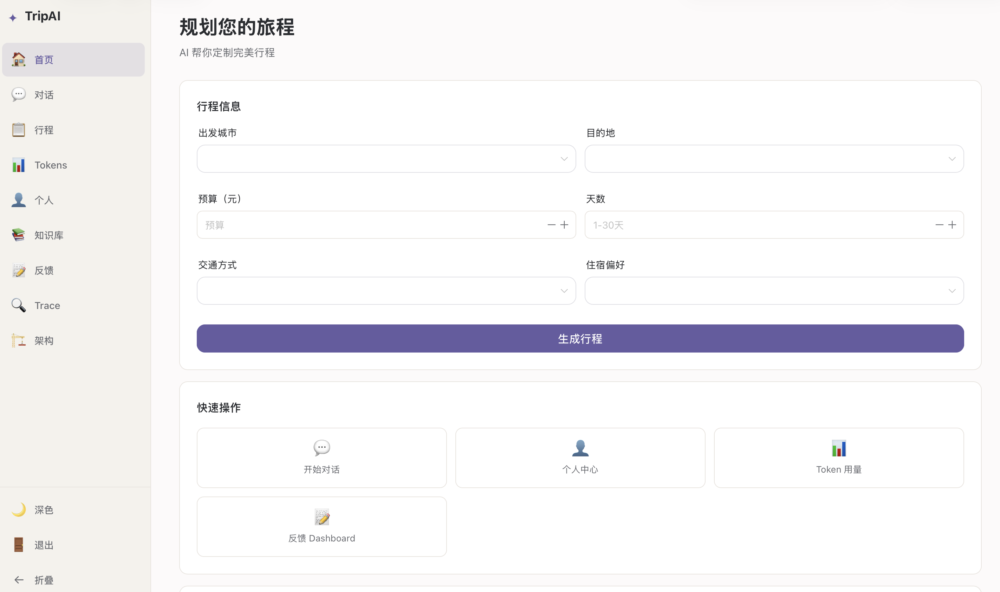
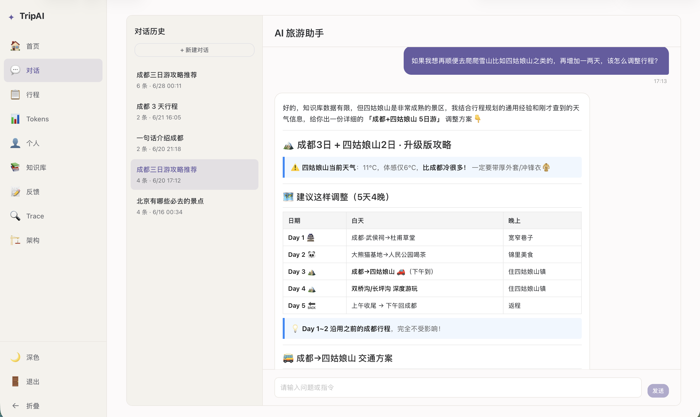
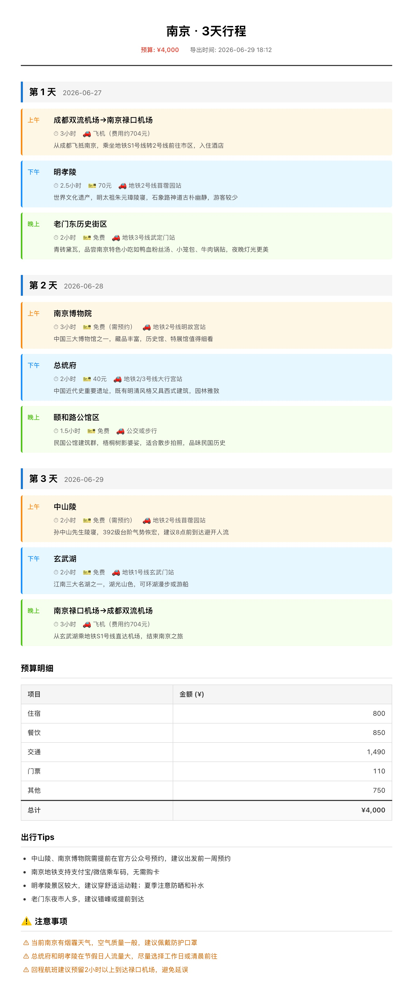
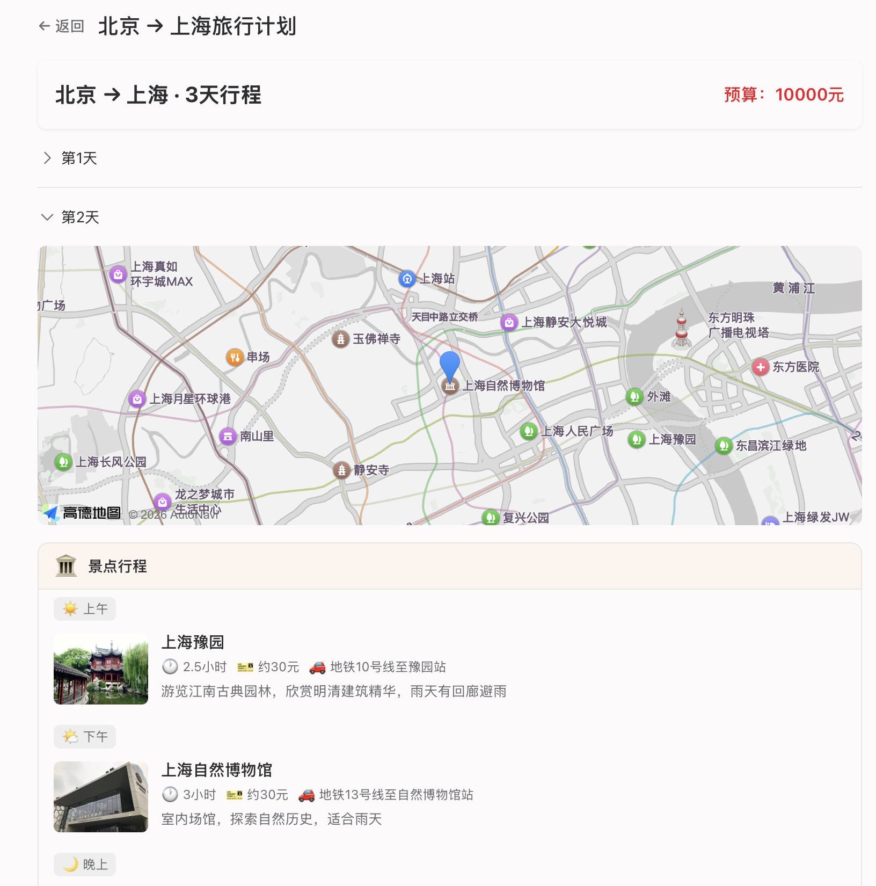

# Trip — AI 智能旅行规划系统

基于 AI 的景点介绍与行程规划系统，输入目的地、预算和天数，AI 自动生成完整旅行计划，并支持对话式交互。

## 技术栈

| 层 | 技术 |
|---|---|
| 前端 | Vue 3 + TypeScript + Vite + Naive UI |
| 后端 | Express 5 + TypeScript |
| 数据库 | MySQL + Prisma ORM + ChromaDB (向量) |
| AI | LangChain + DeepSeek API |

## 功能

- **AI 行程生成** — 输入目的地/预算/天数，自动生成每日行程（含景点、餐饮、住宿）
- **对话式交互** — 与 AI 助手多轮对话，调整行程细节
- **高德地图集成** — 每日行程在地图上标注景点位置
- **多维度检索** — 向量 + 关键词 + 热度 三路召回，Cross-Encoder 重排序
- **行程度量** — 预算明细、出行 Tips

## 界面预览

### 首页 — 行程生成



### 对话页 — AI 交互



### 行程详情 — 每日行程



### 地图 — 景点定位



## 快速开始

### 前置条件

- Node.js >= 18
- MySQL >= 8.0
- ChromaDB（向量数据库）
- DeepSeek API Key

### 启动步骤

```bash
# 1. 安装依赖
cd trip-server && npm install
cd ../trip-front && npm install

# 2. 配置环境变量
cp trip-server/.env.example trip-server/.env
# 编辑 .env，填入数据库连接和 API Key

# 3. 启动 Chroma（二选一）
pip install chromadb && chroma run --path ./chroma_data --host 127.0.0.1 --port 8000
# 或 docker run -d --name chroma -p 8000:8000 chromadb/chroma

# 4. 初始化数据库
cd trip-server
npx prisma db push
npm run seed

# 5. 导入知识库
npm run seed:knowledge
npm run seed:poi

# 6. 启动
# 终端 1 - 后端 (端口 3000)
cd trip-server && npm run dev
# 终端 2 - 前端 (端口 5173)
cd trip-front && npm run dev
```

访问 http://localhost:5173

## API 接口

| 方法 | 路径 | 说明 |
|---|---|---|
| POST | `/api/user/register` | 注册 |
| POST | `/api/user/login` | 登录 |
| GET | `/api/trip/recommend` | AI 生成行程 |
| POST | `/api/trip/chat` | AI 对话（SSE 流式） |
| GET | `/api/conversations` | 对话列表 |
| GET | `/api/history/trips` | 行程历史 |
| GET | `/api/feedback/stats` | 反馈统计（admin） |

## 项目结构

```
trip/
├── trip-front/         # 前端
│   └── src/
│       ├── views/      # 页面组件
│       ├── components/ # 通用组件
│       ├── router/     # 路由
│       ├── api/        # API 调用
│       └── styles/     # 全局样式
└── trip-server/        # 后端
    └── src/
        ├── routes/     # 路由
        ├── controllers/# 控制器
        ├── services/   # 业务逻辑（Agent/RAG/LLM）
        ├── middleware/  # 中间件
        └── config/     # 配置
```

## 知识库 RAG

- **数据规模**：30,784 条 POI 数据，覆盖 343+ 个地级市（热门旅游城市各 ~450 条）
- **数据来源**：手工整理（`data/spots/`）+ 高德地图 API 批量拉取（`scripts/seed-poi-*.ts`）
- **实时补充**：Amap MCP `maps_text_search` 在 agent 规划时可实时查询高德全库 POI（千万级）
- **检索链路**（~640ms P50）：本地关键词改写 → Chroma 向量 / MySQL 关键词 / 评分 三路召回 → RRF 融合 → Cross-Encoder 重排
- **检索优化**：本地关键词提取替代 LLM 改写（省 ~800ms）+ 高分命中跳过重排
- **Embedding**：bge-small-zh-v1.5（本地，512 维，~50ms/次）
- **重排序**：bge-reranker-base Cross-Encoder（top-20）
- **存储**：MySQL（关系索引）+ ChromaDB（向量索引，~23 MB）

## 项目说明

该项目为个人学习项目，用于探索 LLM、RAG 和流式交互在旅行规划场景中的应用。

