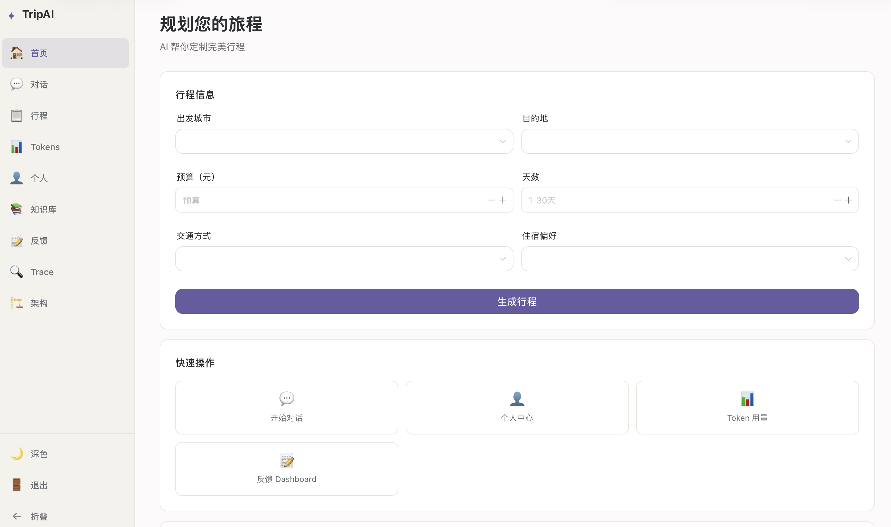
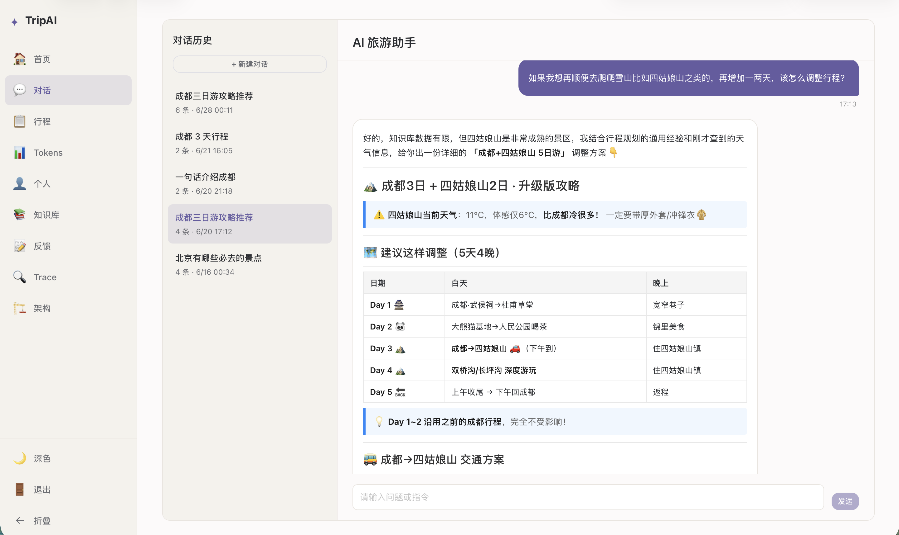
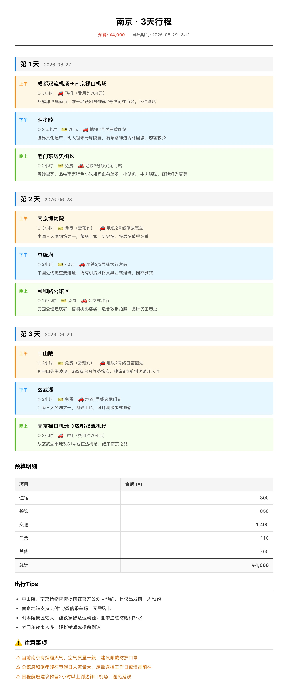
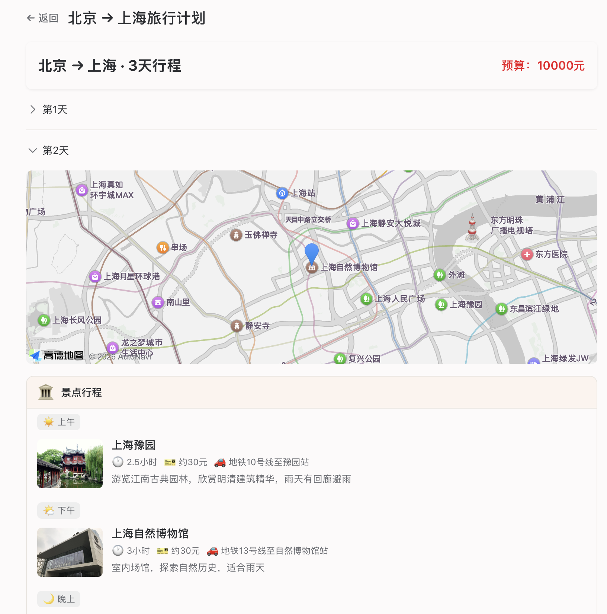

# Trip — AI 智能旅行规划系统

基于 AI 的景点介绍与行程规划系统，输入目的地、预算和天数，AI 自动生成完整旅行计划，并支持对话式交互。

## 技术栈

| 层 | 技术 |
|---|---|
| 前端 | Vue 3 + TypeScript + Vite + Naive UI |
| 后端 | FastAPI (Python 3.12+) |
| 数据库 | PostgreSQL 16 + pgvector (向量) + SQLAlchemy (async) |
| AI | LangChain + LangGraph + DeepSeek API |
| Agent 架构 | 多 Agent 协作（ChatAgent / ResearchAgent / PlannerAgent + Orchestrator 编排） |
| Skill 体系 | SKILL.md 声明式技能（对齐 Anthropic 规范，L1/L2/L3 三层渐进式披露） |

## 功能

- **AI 行程生成** — 输入目的地/预算/天数，自动生成每日行程（含景点、餐饮、住宿）
- **多 Agent 协作规划** — ResearchAgent 自主搜索 → PlannerAgent 生成行程 → Review 校验循环，封闭世界约束杠绝幻觉
- **对话式交互** — ChatAgent 单 Agent ReAct 模式，支持多轮对话、工具调用、行程修改升级
- **需求补全（Intent Completion）** — 输入不完整时（如"周末想出去逛逛"），自动追问缺失字段（目的地/天数/预算），收集齐再生成，避免默认值导致的低质量规划
- **高德地图 MCP 集成** — 通过 MCP 协议实时查询高德全库 POI
- **多维度检索** — pgvector 向量 (bge-small-zh) + PG 全文检索 + 热度 三路召回，Cross-Encoder (bge-reranker) 重排序
- **行程度量** — 预算明细、出行 Tips
- **三层 RAG 评估体系** — 检索层 (Hit@K/MRR) + 生成层 (Faithfulness/Relevancy) + 线上反馈
- **Skill 技能体系** — SKILL.md 声明式驱动，主 LLM 通过 select_skill 工具自主选择技能，多轮 tool calling 编排执行
- **美团酒旅 Skill** — 接入美团官方酒旅 API，支持机票/酒店/火车票/门票查询与预订

## 界面预览

### 首页 — 行程生成



### 对话页 — AI 交互



### 行程详情 — 每日行程



### 地图 — 景点定位



## 快速开始

### 前置条件

- Python >= 3.12
- Docker Desktop（用于运行 PostgreSQL + pgvector）
- Redis（本地安装或 Docker）
- DeepSeek API Key

### 启动步骤

```bash
# 1. 安装后端依赖
cd trip-backend
uv sync

# 2. 配置环境变量
cp .env.example .env
# 编辑 .env，填入数据库连接和 API Key

# 3. 启动 PostgreSQL（含 pgvector 扩展）和 Redis
docker compose up -d postgres redis

# 4. 初始化数据库表 + 索引
uv run python create_tables.py

# 5. 导入种子数据（可选）
uv run python seed_spots.py
uv run python scripts/pgvector_reindex.py   # 批量计算 embedding

# 6. 启动
# 终端 1 - 后端 (端口 8000)
cd trip-backend && uv run uvicorn src.main:app --reload
# 终端 2 - 前端 (端口 5173)
cd trip-front && npm install && npm run dev
```

访问 http://localhost:5173

## API 接口

| 方法 | 路径 | 说明 |
|---|---|---|
| POST | `/api/user/register` | 注册 |
| POST | `/api/user/login` | 登录 |
| GET/PUT | `/api/user/info` | 用户信息 |
| POST | `/api/trip/recommend` | AI 生成行程 |
| POST | `/api/trip/chat` | AI 对话（SSE 流式） |
| GET | `/api/conversations` | 对话列表 |
| GET | `/api/history/trips` | 行程历史 |
| GET/POST | `/api/feedback` | 用户反馈 |
| GET | `/api/feedback/admin/daily-stats` | 反馈统计趋势（admin） |
| GET | `/api/feedback/admin/high-token-low-satisfaction` | 高分低满意度案例（admin） |
| GET | `/api/knowledge/spots` | 景点列表 |
| GET | `/api/admin/agent-trace` | Agent 执行轨迹（admin） |
| GET | `/api/admin/mcp-stats` | MCP 进程监控（admin） |
| GET | `/health` | 健康检查 |

## 项目结构

```
trip/
├── trip-front/          # 前端 (Vue 3)
│   └── src/
│       ├── views/       # 页面组件
│       ├── components/  # 通用组件
│       └── api/         # API 调用层
├── trip-backend/      # 后端 (FastAPI)
│   ├── .claude/skills/  # Skill 技能定义（SKILL.md，Anthropic 标准目录）
│   │   ├── trip-planner/        # 行程规划
│   │   ├── route-optimize/      # 路线优化
│   │   ├── local-life-discovery/ # 周边发现
│   │   ├── meituan-travel/      # 美团酒旅（酒店/机票/火车票/门票）
│   │   └── poi-etl/             # POI 数据管道
│   └── src/
│       ├── controllers/ # 路由/控制器
│       ├── services/    # 业务逻辑（Agent/RAG/LLM）
│       │   └── agent/   # 多 Agent 编排层
│       │       ├── agents/      # 独立 Agent（ChatAgent/ResearchAgent/PlannerAgent）
│       │       ├── orchestrator.py  # 编排层（调度 Agent + 重试循环）
│       │       ├── skills/      # Skill 基座（registry/loader/runtime/selector_tool）
│       │       ├── review.py    # 行程校验（代码层 + LLM 独立审阅）
│       │       ├── intent.py    # 意图抽取（fast-path 规则）
│       │       ├── schemas.py   # Agent 间通信契约
│       │       └── tools/       # 工具（RAG/酒店/距离/MCP）
│       │   └── rag/     # RAG 检索管线
│       │   └── mcp/     # MCP 工具集成
│       ├── middleware/  # 中间件（认证/限流/幂等/并发）
│       ├── models/      # SQLAlchemy 数据模型
│       └── eval/        # Agent & RAG 评估框架
│           ├── fixtures/    # 测试用例（YAML）
│           ├── evaluators/  # 评估器（13+3 个）
│           └── retrieval/   # 检索层评估（Hit@K/MRR）
└── docs/                # 设计文档

## 知识库 RAG

- **数据规模**：30,784 条 POI 数据，覆盖 343+ 个地级市（热门旅游城市各 ~450 条）
- **数据来源**：手工整理（`data/spots/`）+ 高德地图 API 批量拉取（`scripts/seed-poi-*.ts`）
- **实时补充**：Amap MCP `maps_text_search` 在 agent 规划时可实时查询高德全库 POI（千万级）
- **检索链路**（~640ms P50）：本地关键词改写 → pgvector 向量 / PG 全文检索 / 评分 三路召回 → RRF 融合 → Cross-Encoder 重排
- **检索优化**：本地关键词提取替代 LLM 改写（省 ~800ms）+ 高分命中跳过重排
- **Embedding**：bge-small-zh-v1.5（本地，512 维，~50ms/次）
- **重排序**：bge-reranker-base Cross-Encoder（top-20）
- **存储**：PostgreSQL 一体化（关系索引 + pgvector HNSW 向量索引 + tsvector 全文索引）

## RAG 评估体系

项目内置三层 RAG 评估体系，覆盖检索、生成和线上三个维度：

| 层级 | 指标 | 说明 |
|------|------|------|
| 检索层 | Hit@K（K=1/3/5/10/20）、MRR | 量化检索召回质量和排序效果 |
| 生成层 | Faithfulness、Answer Relevancy | LLM-as-Judge 自动评分，衡量幻觉和相关性 |
| 线上 | 点赞/点踩率、高分低满意度 | 复用 Feedback 系统，持续追踪用户真实体验 |

```bash
# 运行评估
cd trip-backend
uv run python -m eval.run                       # Agent 评估（mock）
uv run python -m eval.run --real --tag smoke     # Agent 评估（真实后端）
uv run python -m eval.retrieval.run              # 检索层评估
```

# Skill 技能体系

对齐 [Anthropic Claude Code Skill 规范](https://docs.github.com/zh/copilot/concepts/agents/about-agent-skills)，采用 SKILL.md 声明式定义 + 三层渐进式披露：

| 层级 | 内容 | 何时加载 |
|------|------|----------|
| L1 目录层 | name / description / tags（轻量元信息） | 常驻系统提示词 |
| L2 规格层 | 整篇 SKILL.md 正文（指令/触发/输入/示例） | 技能被选中时 lazy-load |
| L3 实现层 | references / scripts / assets 资源文件 | 执行时按需读取 |

**路由机制**：主 LLM 绑定 `select_skill` 工具，单次调用同时完成路由 + 规划，无独立路由 LLM 调用。

**执行机制**：多轮 tool calling agent loop（最大 10 轮），LLM 读 SKILL.md 指令自行编排底层工具。

**已注册技能**：

| 技能 | 说明 |
|------|------|
| `trip-planner` | 结构化逐日行程规划（景点+美食+酒店） |
| `route-optimize` | 多出行方式最优通勤路线对比 |
| `local-life-discovery` | 周边吃喝玩乐休闲场所发现 |
| `meituan-travel` | 美团酒旅官方（机票/酒店/火车票/门票查询预订） |
| `POI ETL` | POI 数据采集→LLM 标注→双写入库流水线 |

## 多 Agent 架构

系统采用多 Agent 协作架构，每个 Agent 拥有独立上下文、独立工具、独立 LLM 调用：

```
用户消息
  │
  ├── chat() ──→ ChatAgent（单 Agent ReAct，流式对话）
  │                ├── 直接回答（RAG/酒店/天气工具）
  │                ├── trigger_plan ──→ Orchestrator.plan()
  │                └── trigger_modify ──→ Orchestrator.modify()
  │
  └── recommend() ──→ Orchestrator（纯代码编排，非 Agent）
                         ├── ResearchAgent（LLM 自主决定搜索策略，并行调用工具）
                         ├── PlannerAgent（封闭世界约束，创造性生成行程）
                         └── review()（代码校验 + 独立 LLM 审阅，最多 2 轮重试）
```

**设计原则**：
- Agent 的定义：LLM 在其中做“调什么工具、调几次、什么时候停”的自主决策
- 真正的 Agent 只有 3 个：ChatAgent、ResearchAgent、PlannerAgent
- Orchestrator 是纯代码调度，Review/Intent 是函数，不是 Agent
- 对话是“前台单 Agent”，规划是“后台多 Agent”，通过 trip_context 共享行程状态

## 项目说明

该项目为个人学习项目，用于探索 LLM、RAG、多 Agent 协作和流式交互在旅行规划场景中的应用。

