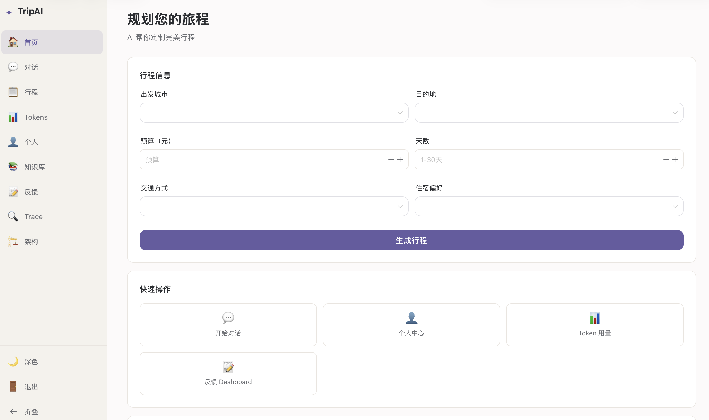
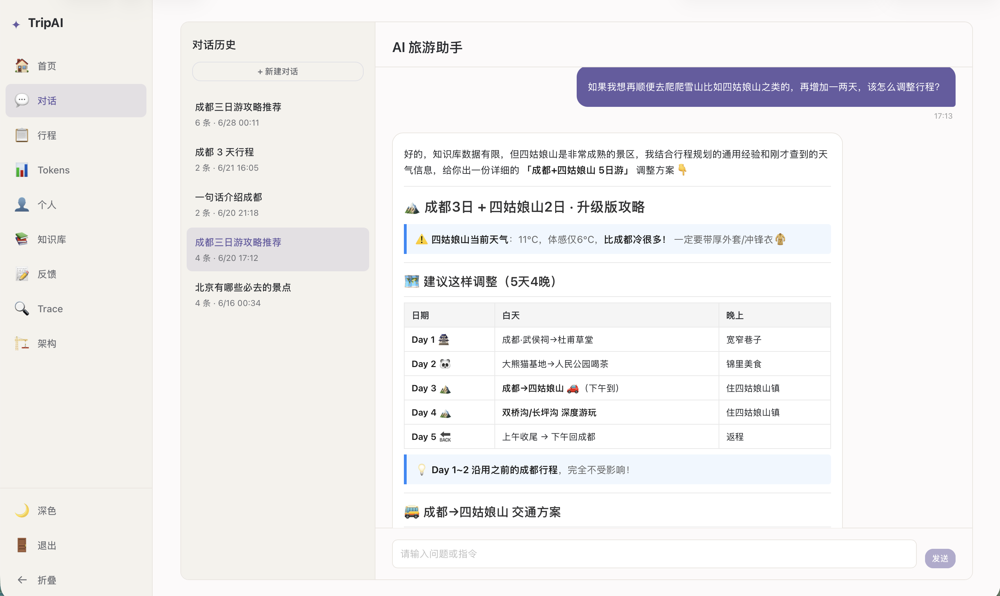
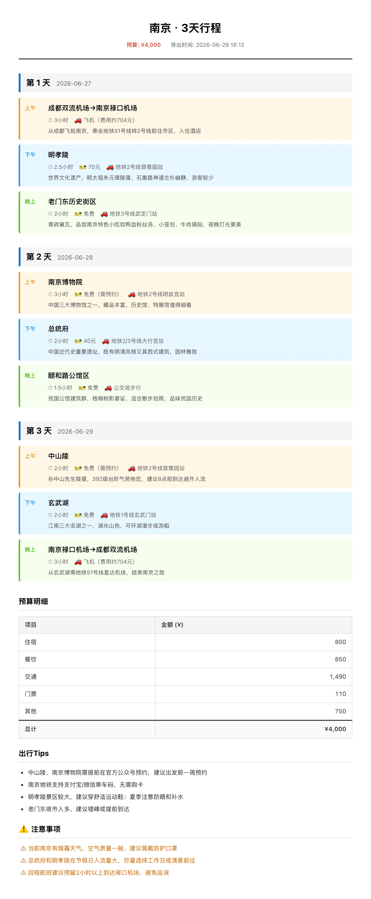
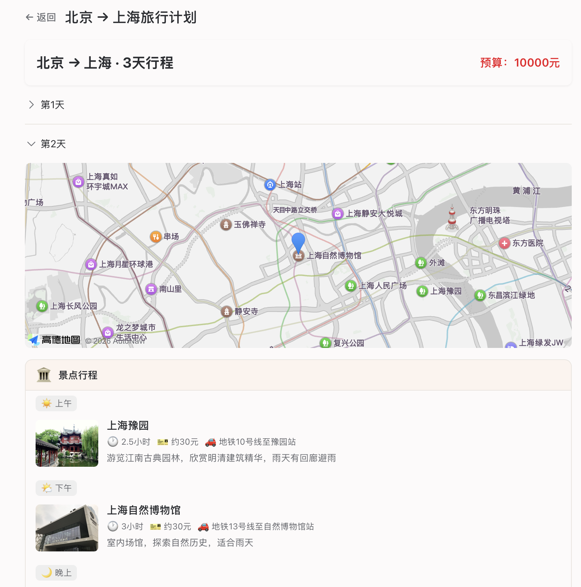

# Trip — AI 智能旅行规划系统

基于 AI 的景点介绍与行程规划系统，输入目的地、预算和天数，AI 自动生成完整旅行计划，并支持对话式交互。

## 技术栈

| 层 | 技术 |
|---|---|
| 前端 | Vue 3 + TypeScript + Vite + Naive UI |
| 后端 | FastAPI (Python 3.12+)；另有 Java 重构版 Spring Boot 3.3 + Java 21（`trip-backend-java/`，与 Python 版共用同一套 PostgreSQL/Redis，前端仅切换 `VITE_API_TARGET`） |
| 数据库 | PostgreSQL 16 + pgvector (向量) + SQLAlchemy (async) |
| AI | LangChain（工具与 prompt 层）+ DeepSeek API；Agent 编排为自研纯代码调度（LangGraph 图已退出主链路） |
| Agent 架构 | 多 Agent 协作（ChatAgent / ResearchAgent / PlannerAgent + Orchestrator 编排） |
| Skill 体系 | SKILL.md 声明式技能（对齐 Anthropic 规范，L1/L2/L3 三层渐进式披露） |

## 功能

- **AI 行程生成** — 输入目的地/预算/天数，自动生成每日行程（含景点、餐饮、住宿）
- **多 Agent 协作规划** — ResearchAgent 自主搜索 → PlannerAgent 生成行程 → Review 校验循环（代码层确定性校验可阻断重试，独立 LLM 审阅提供告警），封闭世界约束杠绝幻觉
- **对话式交互** — ChatAgent 单 Agent ReAct 模式，支持多轮对话、工具调用、行程修改升级
- **需求补全（Intent Completion）** — 输入不完整时（如"周末想出去逛逛"），自动追问缺失字段（目的地/天数/预算），收集齐再生成，避免默认值导致的低质量规划（当前为关键词/城市表 fast-path 规则；小模型兜底慢路径待启用）
- **高德地图 MCP 集成** — 通过 MCP 协议实时查询高德全库 POI
- **多维度检索** — PG 全文检索（zhparser）+ 热度评分 两路召回 + 加权 RRF + credibility 调权；向量召回（pgvector HNSW / bge-small-zh）与 Cross-Encoder 重排（bge-reranker）已实现并有测试覆盖，因本地模型加载稳定性问题当前默认关闭（Java 侧为 `rag.four-way.enabled`，Python 侧见 `knowledge_service.py` 召回路径列表）
- **行程度量** — 预算明细、出行 Tips
- **确定性预算控制** — 预算分解器（allocator）按风格/预算分档将预算分解为住宿/餐饮/交通/门票/其他 5 项上限，生成前注入 prompt；review 逐项校验（弹性 1.15），超支时预算修正器（corrector）按轮次（砍门票→降住宿→砍交通）生成结构化目标分解，替代盲目重写，≤3 轮收敛
- **费用来源标记** — 行程费用标注来源（`rag` 真实人均消费 / `estimate` 城市档位估算 / `distance` 交通粗算），禁止裸编：RAG 检索输出 `spots.avg_cost` 真实价格（当前约 532/30,803 条 POI 带真实价格），缺失时由估算器按城市消费档位兜底
- **可续传流式输出** — SSE 事件实时写入 Redis 事件日志（sequence_id 保序 + TTL），客户端凭 `X-Stream-Id` / `Last-Event-ID` 从断点续推，Redis 不可用时降级内存；前端配套指数退避与按 seq 去重
- **Agent 可观测性** — 每步 LLM 调用与工具调用落库为执行轨迹（`/api/admin/agent-trace`），x-request-id 全链路贯穿，Prometheus 指标暴露 QPS / chat 耗时 / 工具调用计数
- **三层 RAG 评估体系** — 检索层 (Hit@K/MRR) + 生成层 (Faithfulness/Relevancy) + 线上反馈
- **Skill 技能体系** — SKILL.md 声明式驱动，主 LLM 通过 select_skill 工具自主选择技能，多轮 tool calling 编排执行
- **美团酒旅 Skill** — 沙箱化封装官方 `ht-ai query` CLI（列表式传参、无 shell、150s 超时），支持机票/酒店/火车票/门票查询；需配置 `MEITUAN_HT_TOKEN`，缺失时明确报错而非空 token 调用

## 界面预览

### 首页 — 行程生成



### 对话页 — AI 交互



### 行程详情 — 每日行程



### 地图 — 景点定位



## 快速开始

### 前置条件

- Python >= 3.12
- Docker Desktop（用于运行 PostgreSQL + pgvector）
- Redis（本地安装或 Docker）
- DeepSeek API Key

### 启动步骤

```bash
# 1. 安装后端依赖
cd trip-backend
uv sync

# 2. 配置环境变量
cp .env.example .env
# 编辑 .env，填入数据库连接和 API Key

# 3. 启动 PostgreSQL（含 pgvector 扩展）和 Redis
docker compose up -d postgres redis

# 4. 初始化数据库表 + 索引
uv run python create_tables.py

# 5. 导入种子数据（可选）
uv run python seed_spots.py
uv run python scripts/pgvector_reindex.py   # 批量计算 embedding

# 6. 启动
# 终端 1 - 后端 (端口 8000)
cd trip-backend && uv run uvicorn src.main:app --reload
# 终端 2 - 前端 (端口 5173)
cd trip-front && npm install && npm run dev
```

访问 http://localhost:5173

## API 接口

| 方法 | 路径 | 说明 |
|---|---|---|
| POST | `/api/user/register` | 注册 |
| POST | `/api/user/login` | 登录 |
| GET/PUT | `/api/user/info` | 用户信息 |
| POST | `/api/trip/recommend` | AI 生成行程 |
| POST | `/api/trip/chat` | AI 对话（SSE 流式） |
| GET | `/api/conversations` | 对话列表 |
| GET | `/api/history/trips` | 行程历史 |
| GET/POST | `/api/feedback` | 用户反馈 |
| GET | `/api/feedback/admin/daily-stats` | 反馈统计趋势（admin） |
| GET | `/api/feedback/admin/high-token-low-satisfaction` | 高分低满意度案例（admin） |
| GET | `/api/knowledge/spots` | 景点列表 |
| GET | `/api/admin/agent-trace` | Agent 执行轨迹（admin） |
| GET | `/api/admin/mcp-stats` | MCP 进程监控（admin） |
| GET | `/health` | 健康检查 |

## 项目结构

```
trip/
├── trip-front/          # 前端 (Vue 3)
│   └── src/
│       ├── views/       # 页面组件
│       ├── components/  # 通用组件
│       └── api/         # API 调用层
├── trip-backend/      # 后端 (FastAPI)
│   ├── .claude/skills/  # Skill 技能定义（SKILL.md，Anthropic 标准目录）
│   │   ├── trip-planner/        # 行程规划
│   │   ├── route-optimize/      # 路线优化
│   │   ├── local-life-discovery/ # 周边发现
│   │   ├── meituan-travel/      # 美团酒旅（酒店/机票/火车票/门票）
│   │   └── poi-etl/             # POI 数据管道
│   └── src/
│       ├── controllers/ # 路由/控制器
│       ├── services/    # 业务逻辑（Agent/RAG/LLM）
│       │   └── agent/   # 多 Agent 编排层
│       │       ├── agents/      # 独立 Agent（ChatAgent/ResearchAgent/PlannerAgent）
│       │       ├── orchestrator.py  # 编排层（调度 Agent + 重试循环）
│       │       ├── skills/      # Skill 基座（registry/loader/runtime/selector_tool）
│       │       ├── review.py    # 行程校验（代码层 + LLM 独立审阅）
│       │       ├── intent.py    # 意图抽取（fast-path 规则）
│       │       ├── schemas.py   # Agent 间通信契约
│       │       └── tools/       # 工具（RAG/酒店/距离/MCP）
│       │   └── rag/     # RAG 检索管线
│       │   └── mcp/     # MCP 工具集成
│       ├── middleware/  # 中间件（认证/限流/幂等/并发）
│       ├── models/      # SQLAlchemy 数据模型
│       └── eval/        # Agent & RAG 评估框架
│           ├── fixtures/    # 测试用例（YAML）
│           ├── evaluators/  # 评估器（13+3 个）
│           └── retrieval/   # 检索层评估（Hit@K/MRR）
├── trip-backend-java/   # 后端 Java 重构版 (Spring Boot 3.3 / Java 21)
│   ├── src/main/java/com/trip/backend/
│   │   ├── web/         # 11 个控制器 + 过滤器 + 手写 SSE（SseWriter / StreamStore / ResumeHandler）
│   │   ├── service/     # 业务层：Orchestrator 编排 / rag 检索流水线 / llm 网关与 Provider 路由 / chat
│   │   ├── infra/       # skill 体系(L1/L2/L3 + PatchEngine) / ONNX 模型 / TaskQueue / 缓存 / 熔断 / 限流 / 指标
│   │   ├── domain/      # 实体 + JPA Repository（向量与全文检索走 JdbcTemplate 原生 SQL）
│   │   ├── middleware/  # 并发守卫 + token 预算守卫
│   │   └── eval/        # evaluator + fixture 回归
│   ├── scripts/e2e/     # 端到端流程脚本 + Python/Java 对拍（dual-run）
│   └── docs/            # G1–G7 验收报告
└── docs/                # 设计与验收文档（56 篇）
```

## Java 版本（trip-backend-java）

- **目标**：与 Python 版契约兼容（42 个端点、SSE 帧格式、错误体格式、JWT 401/403 语义、Redis key 逐字对齐），前端零改动、数据零迁移（直连同一套 PostgreSQL + Redis，`ddl-auto=none`）
- **技术栈**：Java 21 + Spring Boot 3.3、langchain4j（协议层）+ 自研编排、ONNX Runtime（bge-small-zh-v1.5 Embedder / bge-reranker-base CrossEncoder）、Micrometer + Prometheus、虚拟线程用于模型预热与降级任务
- **检索**：`RetrievalPipeline` 支持两路（默认）/ 四路（`config/rag.properties` 中 `rag.four-way.enabled`）召回，加权 RRF（fulltext 0.7 / rating 0.5 / spots_vector 0.5 / spot_docs_vector 0.3，k=60）+ credibility 调权；模型不可用时按 fail-open/fail-closed 策略降级并记录实际融合路径数
- **任务与缓存**：自研 TaskQueue 双后端（Redis List + SETNX 幂等，Redis 不可用降级到虚拟线程内存执行）、DualBackendCache（Redis + 进程内）
- **技能系统**：SKILL.md 声明式加载，L1 目录常驻 prompt / L2 规格 lazy-load / L3 执行时按需读取；PatchEngine 支持 `replace_slot` / `remove_slot` / `swap_slot` 槽位级修改
- **CI**：`trip-backend-java/.github/workflows/java-ci.yml` 五个 job（unit / integration / build / contract 对拍 / performance）
- **当前状态**：D 阶段收尾完成——ReAct 多轮工具循环已从 Controller 下沉到 `ChatAgent`、SSE 断点续传（`ResumeHandler`）与 Token 记账（`TokenTrackingCallback`）已接入主链路；并建立可重复运行的性能测试脚本 `perf_test.py`，报告归档于 `performance-reports/`（实测 chat 内部路径 P95 ≈ 11ms，端到端瓶颈为外部 LLM 调用）。以代码为准（详见 `CLAUDE.md` §7 说明）

## 知识库 RAG

- **数据规模**：30,791 条 POI（`data/spots/` 153 个城市 JSON，入库 30,803 条），另有 159 篇景点维基原文（`data/wiki_raw/`）切成 SpotDoc 证据块
- **数据来源**：手工整理 + 高德地图 API 批量拉取（`scripts/fetch_gaode_poi.py` → `convert-poi.py` → `seed_spots.py`），维基证据由 `scripts/fetch_wiki.py` 采集、`ingest_spot_docs.py` 入库
- **实时补充**：Amap MCP `maps_text_search` 在 agent 规划时可实时查询高德全库 POI（千万级）
- **检索链路（当前线上路径）**：本地关键词改写 → **两路召回**（PG 全文 zhparser + 热度评分，每路 3s 独立超时、单路失败即跳过）→ 加权 RRF（0.7 / 0.5）+ credibility 调权融合
- **已实现但默认关闭**：pgvector 向量召回（spots / spot_docs，HNSW 索引已在 schema 中）与 bge-reranker Cross-Encoder 重排。Python 侧因本地模型加载不稳定在 `knowledge_service.py` 中暂时跳过，Java 侧由 `rag.four-way.enabled=false` 控制
- **Embedding**：bge-small-zh-v1.5（512 维），Python 侧经 `sentence-transformers` CPU 推理（依赖在 `pyproject.toml` 中暂被注释，启用向量召回时需恢复）；Java 侧经 ONNX Runtime，权重文件需自行导出放入 `trip-backend-java/models/`
- **向量回填**：由异步任务 `services/tasks/embedding_sync.py`（幂等 + 重试）批量计算，或离线跑 `scripts/pgvector_reindex.py`
- **检索优化**：本地关键词提取替代 LLM 改写（省下一次 LLM 往返）+ 每路超时降级 + POI 结果 Redis 缓存（热点城市 1h TTL）+ 工具级 embedding 归一化结果缓存（余弦相似 ≥0.85 命中）
- **存储**：PostgreSQL 一体化（关系索引 + pgvector HNSW 向量索引 + tsvector 全文索引）

## RAG 评估体系

项目内置三层 RAG 评估体系，覆盖检索、生成和线上三个维度：

| 层级 | 指标 | 说明 |
|------|------|------|
| 检索层 | Hit@K（K=1/3/5/10/20）、MRR | 量化检索召回质量和排序效果 |
| 生成层 | Faithfulness、Answer Relevancy | LLM-as-Judge 自动评分，衡量幻觉和相关性 |
| 线上 | 点赞/点踩率、高分低满意度 | 复用 Feedback 系统，持续追踪用户真实体验 |

> **评估现状与边界（以代码为准）**：Agent 评估有 mock 与 `--real` 双模式，真实后端 3 采样通过率当前约 8/10；检索层最近一次报告为 mock 模式下的合成集（gold 命中偏高），向量召回接回前 Hit@K / MRR 不代表真实线上检索质量。历史报告归档在 `eval-reports/`，nightly 跑 mock 回归。

```bash
# 运行评估
cd trip-backend
uv run python -m eval.run                       # Agent 评估（mock）
uv run python -m eval.run --real --tag smoke     # Agent 评估（真实后端）
uv run python -m eval.retrieval.run              # 检索层评估
```

## Skill 技能体系

对齐 [Anthropic Claude Code Skill 规范](https://docs.github.com/zh/copilot/concepts/agents/about-agent-skills)，采用 SKILL.md 声明式定义 + 三层渐进式披露：

| 层级 | 内容 | 何时加载 |
|------|------|----------|
| L1 目录层 | name / description / tags（轻量元信息） | 常驻系统提示词 |
| L2 规格层 | 整篇 SKILL.md 正文（指令/触发/输入/示例） | 技能被选中时 lazy-load |
| L3 实现层 | references / scripts / assets 资源文件 | 执行时按需读取 |

**路由机制**：主 LLM 绑定 `select_skill` 工具，单次调用同时完成路由 + 规划，无独立路由 LLM 调用。

**执行机制**：多轮 tool calling agent loop（最大 10 轮），LLM 读 SKILL.md 指令自行编排底层工具。

**已注册技能**：

| 技能 | 说明 |
|------|------|
| `trip-planner` | 结构化逐日行程规划（景点+美食+酒店） |
| `route-optimize` | 多出行方式最优通勤路线对比 |
| `local-life-discovery` | 周边吃喝玩乐休闲场所发现 |
| `meituan-travel` | 美团酒旅官方 CLI（机票/酒店/火车票/门票查询，需 token） |
| `POI ETL` | POI 数据采集→LLM 标注→双写入库流水线 |

## 多 Agent 架构

系统采用多 Agent 协作架构，每个 Agent 拥有独立上下文、独立工具、独立 LLM 调用：

```
用户消息
  │
  ├── chat() ──→ ChatAgent（单 Agent ReAct，流式对话）
  │                ├── 直接回答（RAG/酒店/天气工具）
  │                ├── trigger_plan ──→ Orchestrator.plan()
  │                └── trigger_modify ──→ Orchestrator.modify()
  │
  └── recommend() ──→ Orchestrator（纯代码编排，非 Agent）
                         ├── ResearchAgent（LLM 自主决定搜索策略，并行调用工具）
                         ├── PlannerAgent（封闭世界约束，创造性生成行程）
                         └── review()（代码校验 + 独立 LLM 审阅，最多 2 轮重试）
```

**设计原则**：
- Agent 的定义：LLM 在其中做“调什么工具、调几次、什么时候停”的自主决策
- 真正的 Agent 只有 3 个：ChatAgent、ResearchAgent、PlannerAgent
- Orchestrator 是纯代码调度，Review/Intent 是函数，不是 Agent
- 对话是“前台单 Agent”，规划是“后台多 Agent”，通过 trip_context 共享行程状态

## 测试与工程化

| 部分 | 规模 | 测试 |
|------|------|------|
| Python 后端 `trip-backend/` | 260 个 .py（`src/` 约 26,000 行） | 61 个测试文件 / 930 个测试函数，含 7 个 e2e |
| Java 后端 `trip-backend-java/` | 231 个 .java（main 约 15,800 行 + test 约 7,400 行） | 35 个测试类 / 159 个用例（单测 + H2 集成 + eval 回归） |
| 前端 `trip-front/` | 53 个 .vue/.ts（约 12,500 行） | 5 个 spec / 43 个用例（SSE 解析、续传、事件渲染） |
| Agent 评估 | 10 个 YAML fixture × 16 个 evaluator | mock / `--real` 双模式 + 多采样投票，25+ 份历史报告 |

CI：根 `.github/workflows/` 有 Python 后端、前端、e2e 接口、eval nightly（cron + 与基线对比）四条流水线；Java 侧 `trip-backend-java/.github/workflows/java-ci.yml` 五个 job（unit / integration / build / contract 对拍 / performance）。

**Java 性能测试**：`trip-backend-java/perf_test.py` 对 6 个端点跑单请求基线（P50/P95/P99，默认每端点 30 次）+ 10 并发压测 + Token 成本估算，一键生成 Markdown 报告；报告归档于 `trip-backend-java/performance-reports/`（最新见 `performance-report-latest.md`）。实测内部链路 P95 在个位数~十毫秒级，登录 P95 ≈ 271ms（BCrypt 开销），单次对话约 2430 Token / 万次约 ¥34。

## 项目说明

个人项目，独立设计与实现（无团队协作、无真实线上流量）。文中所有性能/命中率类数字均为单机本地测量或合成数据集结果，用于说明趋势而非 SLA；若需引用请先复核 `docs/performance-benchmark.md`（该报告基于早期 Node + Chroma 架构，待按 PostgreSQL/pgvector 重测）。

