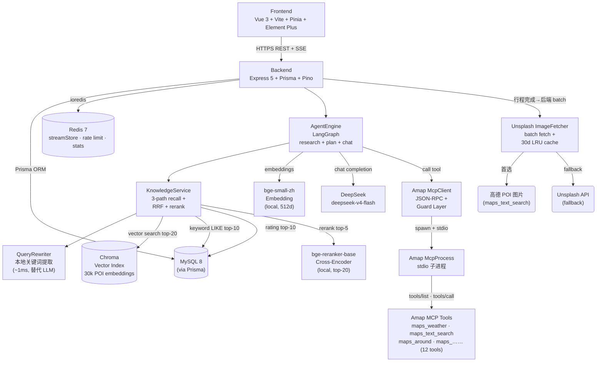
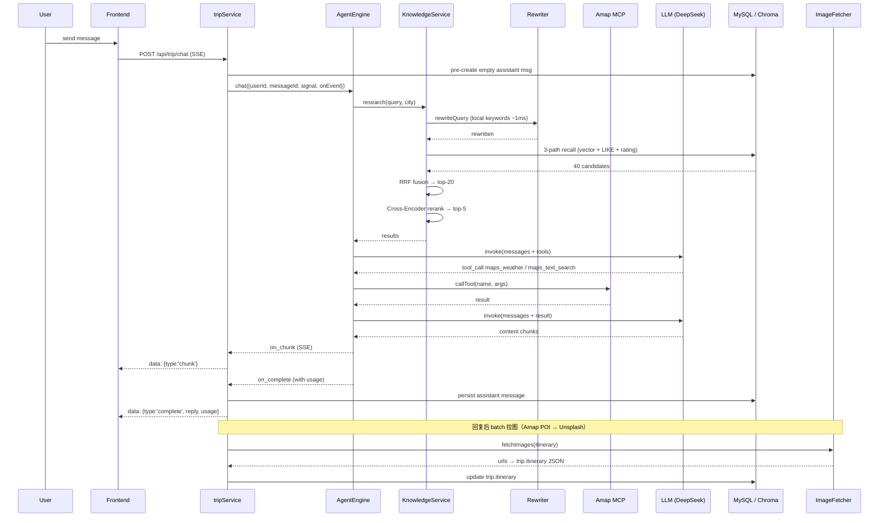
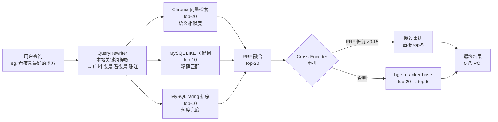
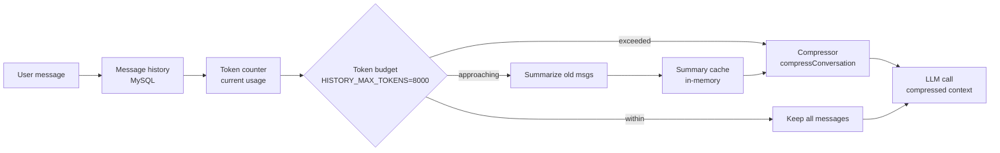
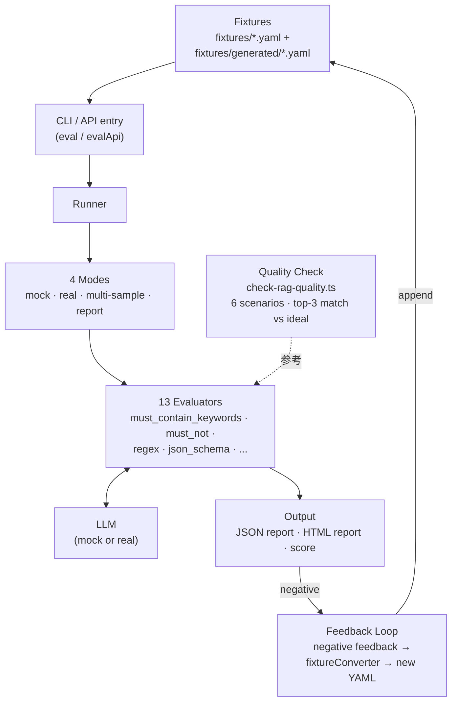

# 架构图 (Architecture Diagrams)

> 5 张 Mermaid 图，覆盖系统架构、Agent 时序、RAG 检索、上下文数据流、评估体系。
> GitHub 原生渲染，源码即真相 (Source of Truth)。

---

## 1. 系统架构图 (System Architecture)

---

## 2. Agent 执行时序 (Agent Execution Sequence)

---

## 3. RAG 检索链路 (RAG Retrieval Pipeline)

---

## 4. 上下文管理数据流 (Context Management Data Flow)

---

## 5. 评估体系 (Evaluation System)

