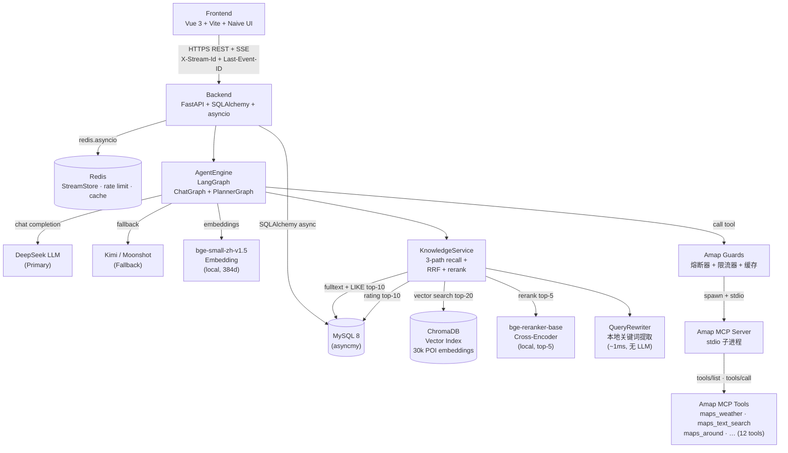
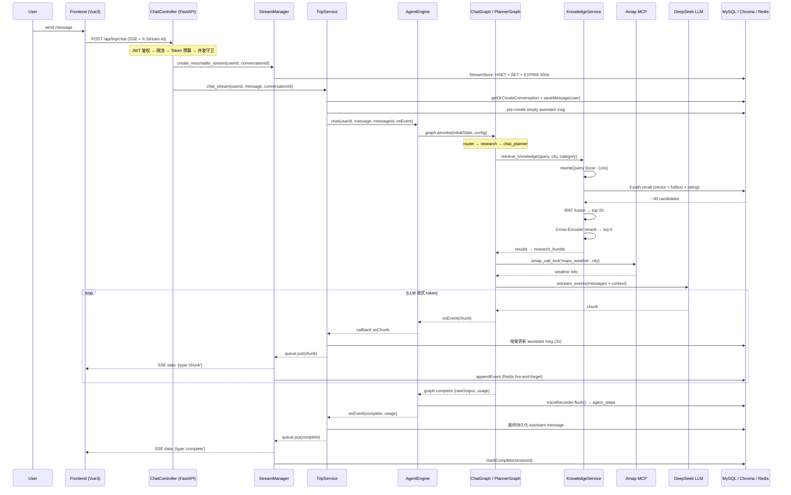
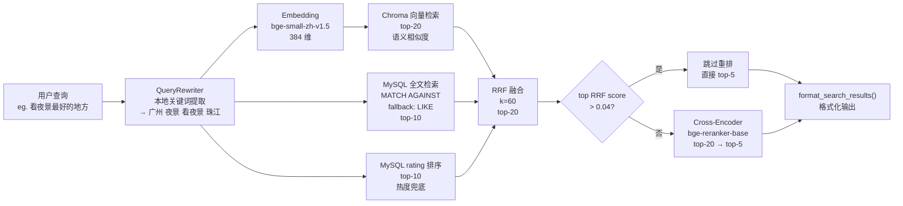
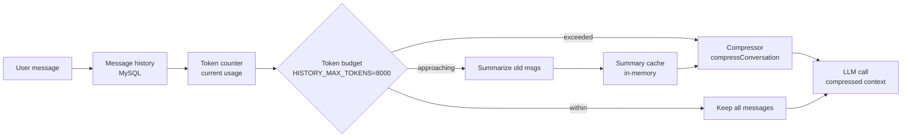
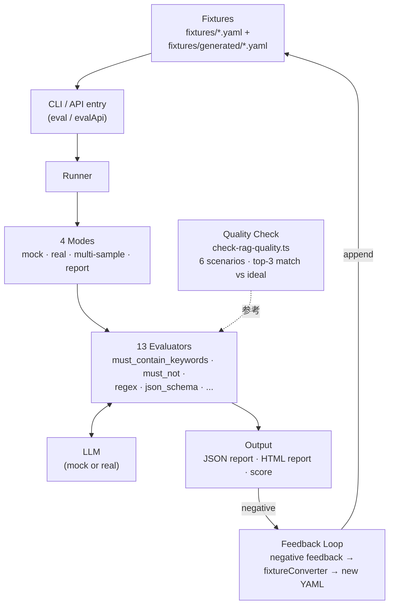

# 架构图 (Architecture Diagrams)

> Mermaid 图，覆盖系统架构、Agent 时序、RAG 检索、上下文数据流、评估体系。
> GitHub 原生渲染，源码即真相 (Source of Truth)。
>
> **详细版本**：`docs/diagrams/system-architecture.mermaid` · `docs/diagrams/rag-pipeline-flow.mermaid`

---

## 1. 系统架构图 (System Architecture)

> 完整版见 [`diagrams/system-architecture.mermaid`](diagrams/system-architecture.mermaid)

```mermaid
flowchart TB
    FE["Frontend<br/>Vue 3 + Vite + Naive UI"]
    BE["Backend<br/>FastAPI + SQLAlchemy + asyncio"]
    DB[("MySQL 8<br/>(asyncmy)")]
    RD[("Redis<br/>StreamStore · rate limit · cache")]
    VC[("ChromaDB<br/>Vector Index<br/>30k POI embeddings")]
    LLM["DeepSeek LLM<br/>(Primary)"]
    LLM_FB["Kimi / Moonshot<br/>(Fallback)"]
    EMB["bge-small-zh-v1.5<br/>Embedding<br/>(local, 384d)"]
    RERANK["bge-reranker-base<br/>Cross-Encoder<br/>(local, top-5)"]
    AGENT["AgentEngine<br/>LangGraph<br/>ChatGraph + PlannerGraph"]
    RAG["KnowledgeService<br/>3-path recall +<br/>RRF + rerank"]
    REWRITER["QueryRewriter<br/>本地关键词提取<br/>(~1ms, 无 LLM)"]
    MCP_PROC["Amap MCP Server<br/>stdio 子进程"]
    MCP_GUARD["Amap Guards<br/>熔断器 + 限流器 + 缓存"]
    MAPS["Amap MCP Tools<br/>maps_weather · maps_text_search<br/>maps_around · … (12 tools)"]

    FE -->|HTTPS REST + SSE<br/>X-Stream-Id + Last-Event-ID| BE
    BE -->|SQLAlchemy async| DB
    BE -->|redis.asyncio| RD
    BE --> AGENT
    AGENT --> RAG
    RAG --> REWRITER
    RAG -->|vector search top-20| VC
    RAG -->|fulltext + LIKE top-10| DB
    RAG -->|rating top-10| DB
    RAG -->|rerank top-5| RERANK
    AGENT -->|embeddings| EMB
    AGENT -->|chat completion| LLM
    AGENT -->|fallback| LLM_FB
    AGENT -->|call tool| MCP_GUARD
    MCP_GUARD -->|spawn + stdio| MCP_PROC
    MCP_PROC -->|tools/list · tools/call| MAPS
```

---

## 2. Agent 执行时序 (Agent Execution Sequence)

> 完整版见 [`sequence-diagram.mermaid`](sequence-diagram.mermaid)

```mermaid
sequenceDiagram
    participant U as User
    participant FE as Frontend (Vue3)
    participant BE as ChatController (FastAPI)
    participant SM as StreamManager
    participant TS as TripService
    participant AE as AgentEngine
    participant G as ChatGraph / PlannerGraph
    participant RAG as KnowledgeService
    participant MCP as Amap MCP
    participant L as DeepSeek LLM
    participant DB as MySQL / Chroma / Redis

    U->>FE: send message
    FE->>BE: POST /api/trip/chat (SSE + X-Stream-Id)
    Note over BE: JWT 鉴权 → 限流 → Token 预算 → 并发守卫
    BE->>SM: create_resumable_stream(userId, conversationId)
    SM->>DB: StreamStore: HSET + SET + EXPIRE 600s
    BE->>TS: chat_stream(userId, message, conversationId)
    TS->>DB: getOrCreateConversation + saveMessage(user)
    TS->>DB: pre-create empty assistant msg
    TS->>AE: chat(userId, message, messageId, onEvent)
    AE->>G: graph.ainvoke(initialState, config)
    Note over G: router → research → chat_planner
    G->>RAG: retrieve_knowledge(query, city, category)
    RAG->>RAG: rewriteQuery (local ~1ms)
    RAG->>DB: 3-path recall (vector + fulltext + rating)
    DB-->>RAG: ~40 candidates
    RAG->>RAG: RRF fusion → top-20
    RAG->>RAG: Cross-Encoder rerank → top-5
    RAG-->>G: results → research_bundle
    G->>MCP: amap_call_tool('maps_weather', city)
    MCP-->>G: weather info
    G->>L: astream_events(messages + context)
    loop LLM 流式 token
        L-->>G: chunk
        G-->>AE: onEvent(chunk)
        AE-->>TS: callback onChunk
        TS->>DB: 增量更新 assistant msg (3s)
        TS-->>SM: queue.put(chunk)
        SM-->>FE: SSE data: {type:'chunk'}
        SM->>DB: appendEvent (Redis fire-and-forget)
    end
    G-->>AE: graph complete (rawOutput, usage)
    AE->>DB: traceRecorder.flush() → agent_steps
    AE-->>TS: onEvent(complete, usage)
    TS->>DB: 最终持久化 assistant message
    TS-->>SM: queue.put(complete)
    SM-->>FE: SSE data: {type:'complete'}
    SM->>DB: markComplete(streamId)
```

---

## 3. RAG 检索链路 (RAG Retrieval Pipeline)

> 完整版见 [`diagrams/rag-pipeline-flow.mermaid`](diagrams/rag-pipeline-flow.mermaid)

```mermaid
flowchart LR
    Q["用户查询<br/>eg. 看夜景最好的地方"] --> RW["QueryRewriter<br/>本地关键词提取<br/>→ 广州 夜景 看夜景 珠江"]
    RW --> EMB["Embedding<br/>bge-small-zh-v1.5<br/>384 维"]
    EMB --> PATH1["Chroma 向量检索<br/>top-20<br/>语义相似度"]
    RW --> PATH2["MySQL 全文检索<br/>MATCH AGAINST<br/>fallback: LIKE<br/>top-10"]
    RW --> PATH3["MySQL rating 排序<br/>top-10<br/>热度兜底"]
    PATH1 & PATH2 & PATH3 --> RRF["RRF 融合<br/>k=60<br/>top-20"]
    RRF --> CE{"top RRF score<br/>> 0.04?"}
    CE -->|是| SKIP["跳过重排<br/>直接 top-5"]
    CE -->|否| RERANK["Cross-Encoder<br/>bge-reranker-base<br/>top-20 → top-5"]
    SKIP --> OUT["format_search_results()<br/>格式化输出"]
    RERANK --> OUT
```

---

## 4. 上下文管理数据流 (Context Management Data Flow)

```mermaid
flowchart LR
    UM[User message] --> HIST[Message history<br/>MySQL]
    HIST --> TC[Token counter<br/>current usage]
    TC --> BUDGET{Token budget<br/>HISTORY_MAX_TOKENS=8000}
    BUDGET -->|within| KEEP[Keep all messages]
    BUDGET -->|approaching| SUMM[Summarize old msgs]
    BUDGET -->|exceeded| CMP[Compressor<br/>compressConversation]
    SUMM --> SC[Summary cache<br/>in-memory]
    SC --> CMP
    CMP --> LLM[LLM call<br/>compressed context]
    KEEP --> LLM
```

---

## 5. 评估体系 (Evaluation System)

```mermaid
flowchart TB
    FX["Fixtures<br/>fixtures/*.yaml +<br/>fixtures/generated/*.yaml"]
    EN["CLI / API entry<br/>(eval / evalApi)"]
    RUN[Runner]
    MD["4 Modes<br/>mock · real · multi-sample · report"]
    EV["13 Evaluators<br/>must_contain_keywords · must_not ·<br/>regex · json_schema · ..."]
    LLM["LLM<br/>(mock or real)"]
    OUT["Output<br/>JSON report · HTML report · score"]
    FB["Feedback Loop<br/>negative feedback →<br/>fixtureConverter → new YAML"]
    QCHK["Quality Check<br/>check-rag-quality.ts<br/>6 scenarios · top-3 match vs ideal"]

    FX --> EN --> RUN
    RUN --> MD --> EV
    EV <--> LLM
    EV --> OUT
    OUT -->|negative| FB
    FB -->|append| FX
    QCHK -.->|参考| EV
```
