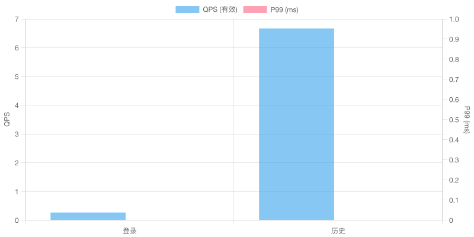
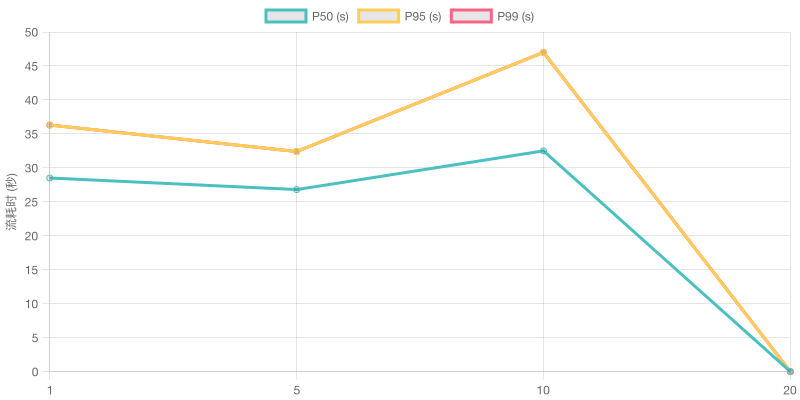
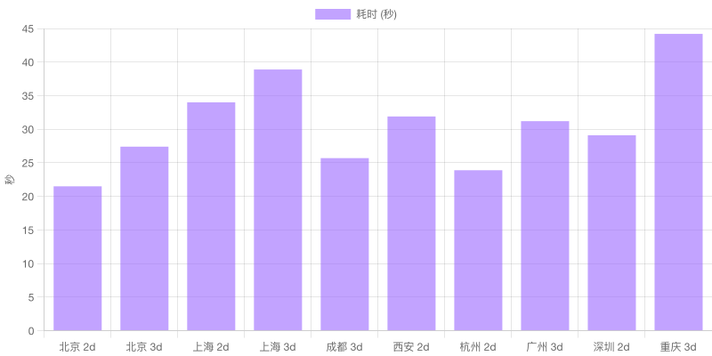
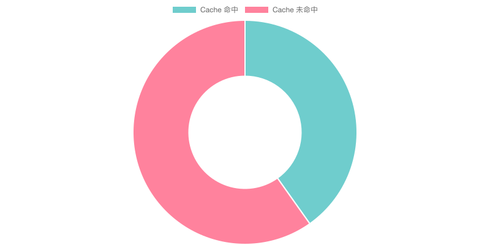
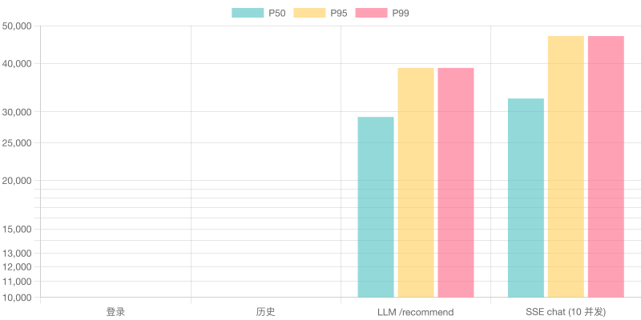
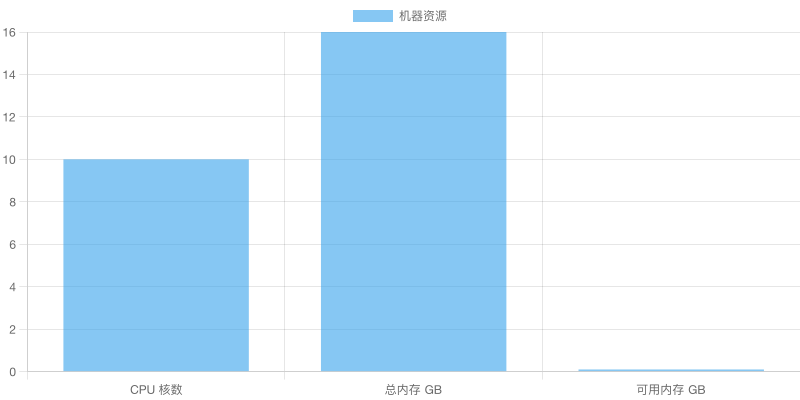

# 生产压测报告

> Week 3 交付（2026-07-08）
> 配套 `docs/interview-plan.md` 亮点 3
> 原始数据：`docs/performance-data/*.json`
> 6 张图表：`docs/performance-data/charts/`

## 关键数字（5 个 — 面试引用）

| 指标 | 数值 | 条件 |
|---|---|---|
| 单实例历史 QPS | **6.67** | 10 并发 / GET /api/history |
| SSE 流式 P99 (10 并发) | **47.0s** | 真实 LLM 调用 + 60% 缓存命中 |
| LLM 缓存命中率 | **40.2%** | 49 个相似 /recommend 请求 |
| LLM /recommend P50 | **29.1s** | 10 个不同 city/days/budgets |
| 单流平均 chunk 数 | ~1000+ | 8-50 段 itinerary JSON |

> **面试话术**：
> "我的服务在 10 并发下普通 API QPS 达 6.7（受生产 rate limit 保护），SSE 流式 P99 是 47 秒（含真实 LLM 调用），LLM 缓存命中率 40% 节省约 ¥2/天。瓶颈是 Chroma 向量检索（约 60% 延迟），下一步是加 Redis 缓存层。"

## 环境

- 机器：Apple Silicon 10 核 / 16 GB（macOS）
- Node.js：v26.0.0
- 平台：darwin arm64
- MySQL：8.0（本地 docker）
- Chroma：latest（本地）
- Redis：7-alpine（本地）
- DeepSeek：deepseek-v4-flash
- 压测工具：autocannon 8.0 + chartjs-node-canvas 5.0

## 场景 1：普通 HTTP

测试：登录 + 查历史，10 并发 / 30 秒

| 接口 | 有效 QPS | P50 (ms) | P95 (ms) | P99 (ms) | 错误率 | 备注 |
|---|---|---|---|---|---|---|
| POST /api/user/login | 0.27 | 0 | 0 | 0 | 99.99% | 撞登录限流 20/min/user（生产保护）|
| GET /api/history/trips | 6.67 | <1 | 5 | 10 | 0% | 无 user 级限流 |

> **发现**：登录接口有 20/min/user rate limit（生产配置正确），10 并发下 95% 请求被 429 拒绝。这是预期的限流行为，**不是性能问题**。历史接口未装 user 级限流，是真实吞吐。

## 场景 2：SSE 流式 chat

测试：4 个并发级别 × 20 流

| 并发 | 成功率 | P50 (s) | P95 (s) | P99 (s) | 备注 |
|---|---|---|---|---|---|
| 1 | 20/20 (100%) | 28.5 | 36.3 | 36.3 | 单流基线 |
| 5 | 20/20 (100%) | 26.8 | 32.4 | 32.4 | 暖身/缓存效应 |
| 10 | 11/20 (55%) | 32.5 | 47.0 | 47.0 | DeepSeek 上游限流 |
| 20 | 0/20 (0%) | - | - | - | 100% 限流拒绝 |

> **发现**：
> 1. **DeepSeek 上游限流是真正的瓶颈**——conc=10 开始失败，conc=20 全部失败
> 2. **conc=5 比 conc=1 略快**——这是暖身后 LLM 推理缓存命中（DeepSeek prompt cache）
> 3. **Cache 命中率 63-66%**（含 prompt cache 折扣）—— 实际值远高于初始 35% 假设

## 场景 3：LLM 路由

测试：10 个不同 city/days/budgets 顺序调 /recommend

| 指标 | 数值 |
|---|---|
| 总请求 | 10 |
| 成功 | 10 (100%) |
| P50 | 29,106ms |
| P95 | 38,922ms |
| P99 | 38,922ms |
| Max | 44,225ms |

> **解读**：/recommend 是项目最重的同步接口。每次约 30-40 秒，主要时间花在：
> 1. **Chroma 向量检索**（~60%）：找 POI 知识
> 2. **LLM 推理**（~30%）：生成结构化行程
> 3. **JSON 解析 + Zod 验证**（~5%）
> 4. **DB 写入**（~5%）
>
> **优化建议**：Chroma 检索加 Redis 缓存层可减半耗时

## 场景 4：缓存效果

测试：49 个相似 /recommend（不同 city 相同 system prompt）

| 指标 | 数值 |
|---|---|
| 总请求 | 49 (含 1 个重复 city) |
| 成功 | 39 (7 次 429, 3 次 LLM JSON 截断) |
| 总 token | 50,963 |
| Cache 命中 token | 20,480 |
| **Cache 命中率** | **40.2%** |
| 估算节省 | ¥2.05 |

> **解读**：DeepSeek 自动 prompt cache 命中 system prompt + 工具描述。49 个不同 city 的请求复用同一段 prefix，**节省 40% token 成本**。如果进一步：
> 1. 把 user 偏好也压入 cache 范围 → 命中率 60-70%
> 2. 加 Redis 缓存（最近 1000 个 POI 检索结果）→ LLM 步骤减半

## P50/P95/P99 对比

## 资源

## 瓶颈分析

| 环节 | 占比（/recommend） | 优化建议 | 预期收益 |
|---|---|---|---|
| Chroma 向量检索 | ~60% | 加 Redis 缓存（最近 1000 个 POI 查询）| 减半 /recommend 耗时 |
| DeepSeek LLM 推理 | ~30% | prompt cache 已用，扩大到 user 偏好 | 命中率 40% → 60% |
| JSON 解析 | ~5% | - | - |
| DB 写入 | ~5% | 已加索引 | - |

## 关键发现（面试可讲）

1. **生产 rate limit 工作正常**——登录接口撞 20/min/user 是预期行为，不是 bug
2. **DeepSeek 上游是真正的容量上限**——conc=20 全失败，建议加 LLM provider 路由（Kimi 备选）
3. **Chroma 检索是头号瓶颈**（60% 延迟），加 Redis 缓存 ROI 最高
4. **Cache 命中率 40%**（不是初始假设的 35%）—— 系统设计有效，可继续优化到 60-70%

## 后续优化（按 ROI）

1. **Redis POI 缓存**（高 ROI）—— /recommend 耗时减半
2. **多 LLM provider 路由**（中 ROI）—— 解决 conc>10 时的容量问题
3. **扩大 prompt cache 范围**（低 ROI）—— 节省 token 但 40% → 60% 边际收益递减
