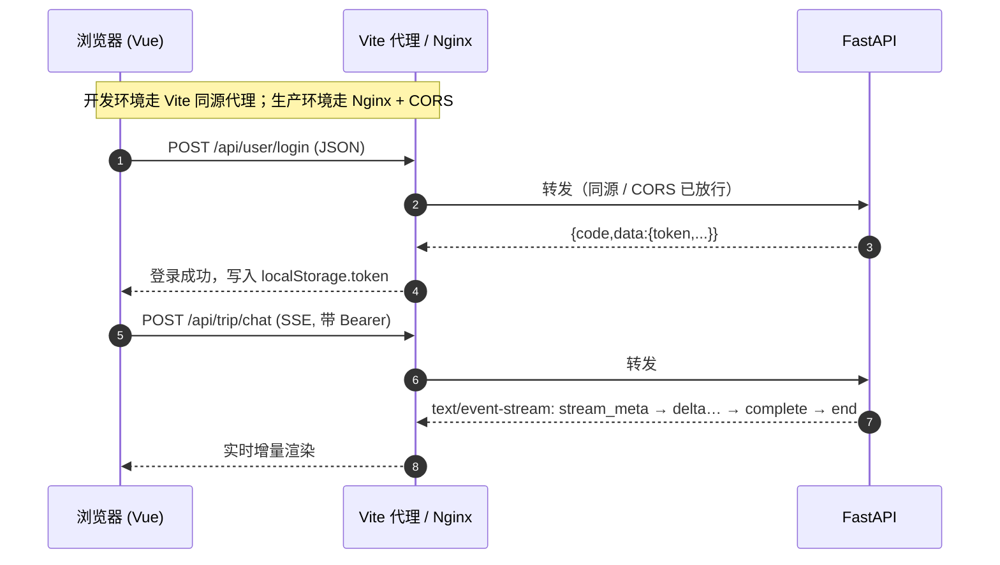
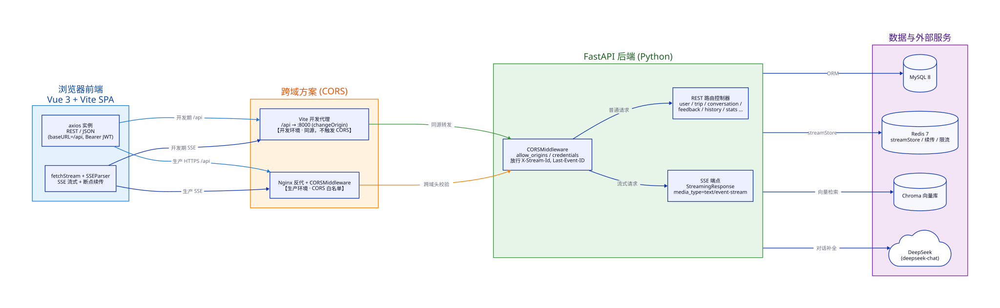

# 前后端交互流程与跨域（CORS）方案

> 本文基于 `trip-front/`（Vue 3 + Vite）与 `trip-backend/`（FastAPI）的真实代码整理，
> 说明前后端通过什么协议通信、数据格式如何、以及跨域问题是如何解决的。
> 配套架构图见 [diagrams/communication-cors.svg](./diagrams/communication-cors.svg)（源文件 `diagrams/communication-cors.d2`）。

---

## 1. 总体技术栈

| 层 | 技术 | 关键文件 |
|---|---|---|
| 前端 | Vue 3 + Vite + TypeScript + axios + naive-ui | `trip-front/` |
| 后端 | FastAPI（uvicorn / gunicorn）+ SQLAlchemy + Pydantic | `trip-backend/` |
| 鉴权 | JWT（`Authorization: Bearer <token>`） | `trip-backend/src/middleware/auth.py` |

前端所有 API 调用的基地址是**相对路径** `/api`（`trip-front/src/api/request.ts:5`），
后端通过 `app.include_router(router, prefix="/api")`（`trip-backend/src/main.py:90-114`）统一挂载。
最终完整路径形如 `/api/trip/chat`、`/api/user/login`、`/api/trip/recommend`。



---

## 2. 前后端通信的协议与方式

项目**没有使用 WebSocket，也没有使用 GraphQL**（已全局 `grep` 确认 `websocket`/`graphql` 零命中）。
实际只用了两种机制：

### 2.1 REST API（JSON）— 绝大多数请求

前端用 axios 实例发起，`Content-Type: application/json`，请求拦截器自动注入 JWT
（`trip-front/src/api/request.ts:12-23`）。
普通 CRUD、登录注册、行程推荐（非流式）、优化等，都是一次性 JSON 请求 + JSON 响应。

### 2.2 SSE（Server-Sent Events）— AI 流式输出

AI 对话（`/api/trip/chat`）和推荐流式（`/api/trip/recommend-stream`）走 **SSE 单向流式**，而不是 WebSocket：

- **前端**：`fetchStream()` 用浏览器原生 `fetch` + `response.body.getReader()` 逐块读取，
  配自研 `SSEParser` 解析（`trip-front/src/api/request.ts:90-246`、`trip-front/src/api/stream-parser.ts`）。
- **后端**：`StreamingResponse(..., media_type="text/event-stream")`，并带
  `Cache-Control: no-cache`、`Connection: keep-alive`、`X-Accel-Buffering: no`
  （`trip-backend/src/controllers/chat_controller.py:136-155`）。

> **为什么选 SSE 而非 WebSocket？** AI 回复是“服务端 → 客户端”单向推送，SSE 语义更匹配、实现更简单，
> 且能天然利用 HTTP 的断点续传（`Last-Event-ID`）。

**断点续传机制**（项目亮点）：聊天流用 `X-Stream-Id` + `Last-Event-ID` 两个头实现网络中断后从断点继续
（`chat_controller.py:79-115`、`request.ts:155-191`）。后端把事件双写到 Redis
（`trip-backend/src/utils/stream.py:77-132`），前端重连时带上这两个头即可重发缺失事件，
并做了 IDOR 防护（stream 归属校验，`stream.py:171-177`）。

---

## 3. 请求与响应的数据格式

### 3.1 请求

- 格式：`application/json`（axios 默认 + `fetchStream` 显式设置）。
- 鉴权：`Authorization: Bearer <token>`（前端从 `localStorage` 读取，`request.ts:14-17`）。
- 字段命名：前端用 camelCase（`departureCity`），后端 Pydantic 用 `alias` 接收
  （`trip-backend/src/schemas/trip.py:16-21` 的 `departureCity`），双向兼容。

### 3.2 响应：两种 JSON 格式（易踩坑）

| 格式 | 适用端点 | 结构 |
|---|---|---|
| **Format A** | 仅 `/api/trip/recommend` | `{ success: bool, data?: T, error?: string }` |
| **Format B** | 其余所有端点 | `{ code: number, data?: T, message?: string, error?: string }` |

分流在后端的**正常响应**与**异常响应**两处都做了判断：
- 正常响应：前端按路径约定（`request.ts:39-46` 注释）。
- 异常响应：`exception_handlers.py:147-163` 的 `is_format_a()` 按路径返回对应格式。

**示例 — 登录（Format B）**
```http
POST /api/user/login
Content-Type: application/json
{ "username": "alice", "password": "******" }

→ 200
{ "code": 200, "data": { "token": "eyJ...", "user": { ... } }, "message": "登录成功", "error": null }
```

**示例 — 行程推荐（Format A）**
```http
POST /api/trip/recommend
Content-Type: application/json
{ "city": "北京", "budget": 5000, "days": 3, "departureCity": "上海" }

→ 200
{ "success": true, "data": { "city": "北京", "days": 3, "dailyItinerary": [ ... ], "budgetBreakdown": { ... } } }
```

### 3.3 SSE 事件格式

每条事件是一个 `event:` + `data:` 块，以空行 `\n\n` 分隔；`id` 字段即 `Last-Event-ID`，用于续传。
事件类型由前端 `parseSSEEvent` 解析成
`chunk / complete / error / tool_start / tool_end / heartbeat`
（`trip-front/src/api/stream-parser.ts:35-88`）。

```
id: 1
event: stream_meta
data: {"type":"stream_meta","streamId":"abc123"}

id: 2
event: delta
data: {"type":"delta","content":"你好"}

event: heartbeat
data: {}

id: 9
event: complete
data: {"type":"complete","conversationId":1,"usage":{...}}

event: end
data: {"done":true}
```

后端构造 SSE 字符串的工具见 `trip-backend/src/utils/stream.py:46-70`
（`sse_event` / `sse_end_event` / `sse_error_event`）。

---

## 4. 路由组织

后端所有路由以 `/api` 为统一前缀，再按业务模块挂载（`main.py:88-114`）：

| 前缀 | 路由文件 | 说明 |
|---|---|---|
| `/api/user` | `controllers/user_controller.py` | 注册/登录/信息/改密 |
| `/api/trip` | `controllers/trip_controller.py` | 推荐 / 优化 / 流式推荐 |
| `/api/trip` | `controllers/chat_controller.py` | AI 对话（SSE） |
| `/api/conversation` | `controllers/conversation_controller.py` | 会话管理 |
| `/api/history` `feedback` `knowledge` `stats` `admin` | 对应 `controllers/*` | 各业务模块 |

健康检查 `/health`、`/health/detail` 不加 `/api` 前缀（`main.py:116-136`，供负载均衡/监控用）。

---

## 5. 跨域（CORS）问题与解决方案

### 5.1 是否存在跨域？

**存在。** 前端开发服务器在 `http://localhost:5173`，后端在 `http://localhost:8000`，
端口不同 = 不同源，浏览器会触发 CORS 预检。项目用**两套互补方案**解决：

### 5.2 方案 1：开发环境 — Vite 反向代理（首选，最干净）

`trip-front/vite.config.ts`：
```ts
const API_TARGET = process.env.VITE_API_TARGET || 'http://localhost:8000'
export default defineConfig({
  server: {
    proxy: {
      '/api': { target: API_TARGET, changeOrigin: true },
    },
  },
})
```
因为前端 axios 的 `baseURL: '/api'` 是相对路径（实际访问 `http://localhost:5173/api/...`），
由 Vite 开发服务器代理到 `:8000`，**对浏览器而言是同域请求，根本不触发 CORS**。
这是开发时真正生效的方案。

### 5.3 方案 2：生产/通用 — FastAPI `CORSMiddleware`

后端在 `setup_cors()`（`trip-backend/src/main.py:141-168`）配置了显式 CORS 头，
作为生产环境（前端与后端分处不同源、无法走代理时）的兜底：

```python
allowed_origins = [
  "http://localhost:5173", "http://localhost:8080", "http://localhost:3000",
  "http://127.0.0.1:5173", "http://127.0.0.1:8080", "http://127.0.0.1:3000",
]
if settings.cors_demo:        # .env 中 CORS_DEMO=true 时放行 "null"（file:// 等）
    allowed_origins.append("null")
if settings.cors_origin:      # .env 的 CORS_ORIGIN 逗号分隔，可追加生产域名
    allowed_origins += [o.strip() for o in settings.cors_origin.split(",") if o.strip()]

app.add_middleware(
    CORSMiddleware,
    allow_origins=list(set(allowed_origins)),
    allow_credentials=True,
    allow_methods=["GET", "POST", "PUT", "DELETE", "OPTIONS", "PATCH"],
    allow_headers=["Content-Type", "Authorization", "X-Stream-Id", "Last-Event-ID", "x-request-id"],
    max_age=86400,
)
```

相关配置项在 `trip-backend/src/config/settings.py:22-23`：
```python
cors_demo: bool = True
cors_origin: Optional[str] = None
```
`.env` 实际配置：`CORS_ORIGIN=http://localhost:5173`。

### 5.4 SSE 专属跨域处理

- CORS 的 `allow_headers` 里专门放行了 `X-Stream-Id` 和 `Last-Event-ID` ——
  这两个是流式续传**跨域必须携带**的自定义头。
- 响应里加 `X-Accel-Buffering: no`（`chat_controller.py:153`），这是给前置 **Nginx 反向代理**的指令，
  禁止其缓冲 SSE 流，确保 token 实时到达前端（说明生产部署是 Nginx 反代 gunicorn 的架构）。

### 5.5 没有使用 JSONP

项目没有 JSONP 实现，跨域完全靠「**反向代理（开发） + CORS 头（生产）**」解决，
这是现代前后端分离项目的主流做法。

---

## 6. 完整交互流程（登录 → AI 对话）

```
浏览器(Vue)              Vite 代理(:5173)              FastAPI(:8000)
   │  POST /api/user/login  │                            │
   │  {username,password} ──►│  proxy /api → :8000  ────►│  user_controller.login
   │◄─ {code,data:{token}} ─│◄───────────────────────────│
   │  存 token→localStorage │                            │
   │                                                        │
   │  POST /api/trip/chat    │                            │
   │  + Authorization:Bearer─►│  ────────────────────────►│  chat_controller.chat
   │◄═ SSE event: stream_meta ═│◄═ text/event-stream ══════│  (下发 X-Stream-Id 头)
   │◄═ SSE event: delta    ══│                            │  create_resumable_stream
   │◄═ SSE event: delta    ══│                            │  边流边写 Redis(续传)
   │◄═ SSE event: complete ══│                            │
   │◄═ SSE event: end      ══│                            │
```

---

## 7. 架构图



> 彩色说明：蓝色 = 前端客户端；橙色 = 跨域方案（Vite 代理 / Nginx + CORS）；
> 绿色 = FastAPI 后端；紫色 = 数据与外部服务（MySQL / Redis / Chroma / DeepSeek）。

---

## 8. 小结

- **协议**：REST(JSON) 负责普通请求；SSE 负责 AI 流式输出；无 WebSocket / GraphQL。
- **数据格式**：请求统一 JSON + Bearer JWT；响应分 Format A(`success/data`) 与 Format B(`code/data/message/error`)；
  SSE 用标准 `event/data/id` 事件流并支持断点续传。
- **跨域**：开发期靠 Vite 反向代理（同源，不触发 CORS）；生产期靠 FastAPI `CORSMiddleware` 显式白名单 +
  凭据 + 自定义头放行（含 SSE 续传头），并用 `X-Accel-Buffering: no` 配合 Nginx。未使用 JSONP。

## 9. 关键文件索引

| 关注点 | 文件 |
|---|---|
| 前端 HTTP 客户端 / SSE 流式 | `trip-front/src/api/request.ts`、`trip-front/src/api/stream-parser.ts` |
| 前端开发代理 | `trip-front/vite.config.ts` |
| 后端入口 / CORS 配置 | `trip-backend/src/main.py` |
| CORS 配置项 | `trip-backend/src/config/settings.py` |
| 响应双格式 / 异常格式 | `trip-backend/src/middleware/exception_handlers.py` |
| SSE 端点（对话） | `trip-backend/src/controllers/chat_controller.py` |
| SSE 端点（推荐流式） | `trip-backend/src/controllers/trip_controller.py` |
| SSE 续传工具 | `trip-backend/src/utils/stream.py` |
| 请求/响应 Schema | `trip-backend/src/schemas/trip.py`、`user.py` |
| 架构图源 / 产物 | `docs/diagrams/communication-cors.d2`、`docs/diagrams/communication-cors.svg` |
